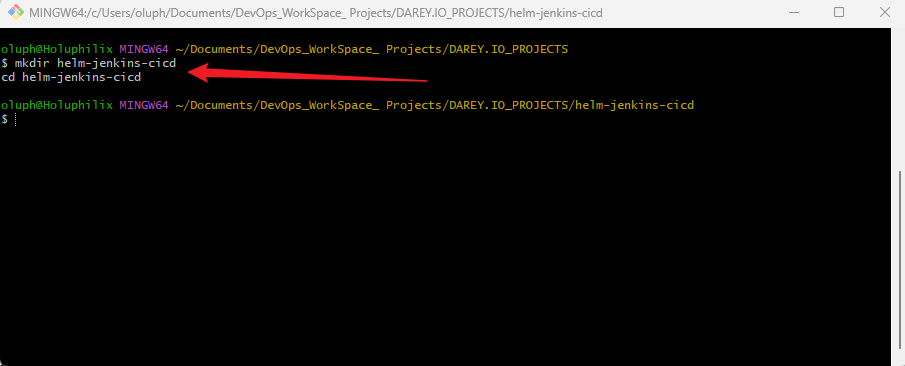
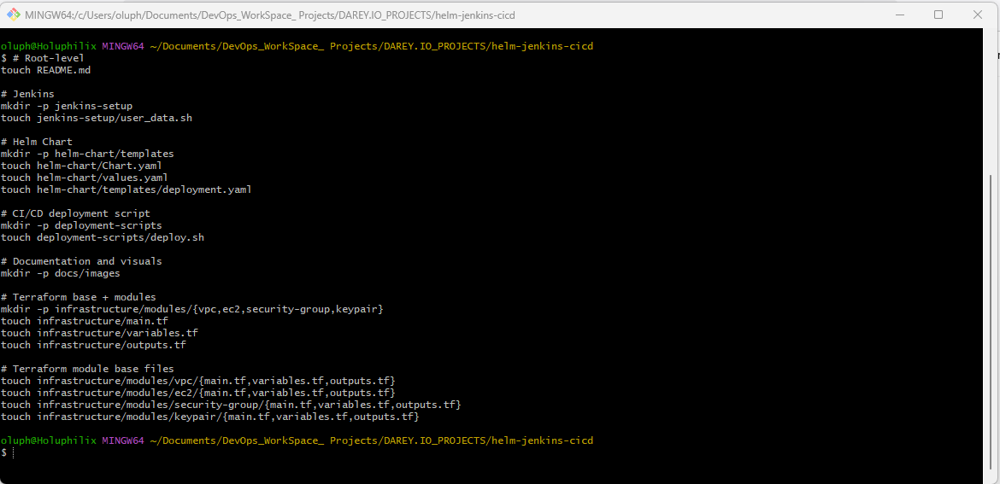
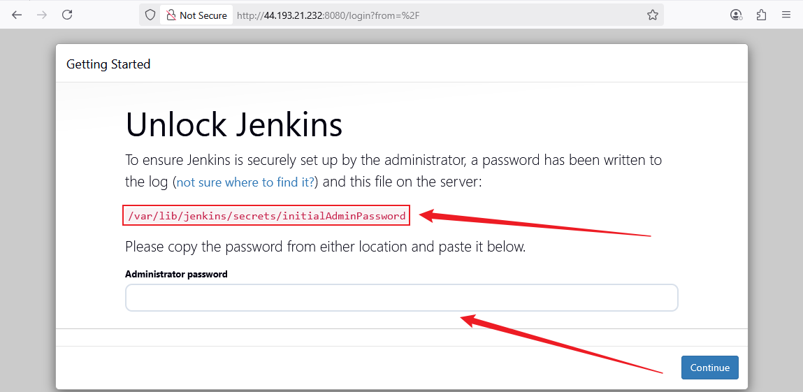
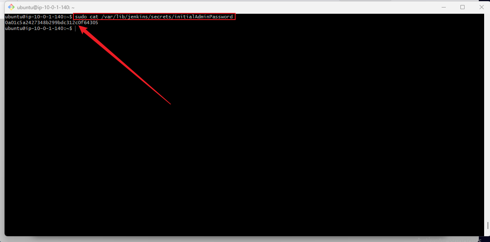

# 🧠 **Capstone Project: Configuration Management With Helm**

## 📘 **Project Scenario**

In today’s DevOps-driven world, streamlining application deployments and managing Kubernetes resources efficiently is crucial. This capstone project introduces you to **Helm**, the powerful package manager for Kubernetes, and demonstrates how to integrate it with **Jenkins**, an industry-standard CI/CD automation tool.

As a **Junior DevOps Engineer**, your mission is to design and implement a **simplified CI/CD pipeline** that uses **Helm charts** to automate the deployment of a **sample web application**. This project will help you solidify your understanding of modern DevOps tooling and give you hands-on experience with configuration management, infrastructure provisioning, and deployment automation.


## 🧩 **Project Goals and Objectives**

* Provision infrastructure using **Terraform** to host Jenkins.
* Install and configure **Jenkins** with required plugins and security settings.
* Learn the fundamentals of **Helm** and create basic Helm charts.
* Automate application deployments using **Jenkins + Helm** integration.
* Demonstrate a full CI/CD workflow in a modular, beginner-friendly way.


## ✅ **Prerequisites**

To successfully complete this project, you should have:

* Basic understanding of **Jenkins** and its CI/CD concepts.
* Completion of the following foundational mini-projects:

  * *Introduction to Helm Charts*
  * *Working with Helm Charts*
* Access to a **Linux server** (e.g., EC2 or virtual machine) for hosting Jenkins.
* A working **Terraform setup** (CLI installed and configured).
* Basic understanding of **Git**, **Bash**, and **Kubernetes** concepts.

## 📦 **Project Deliverables**

### 📄 Documentation:

* Structured setup guides for Jenkins, Helm, and CI/CD pipeline implementation.
* `user_data.sh` script for automated Jenkins provisioning.
* Clear explanations of basic security practices used in Jenkins.
* Helm chart structure and deployment examples.

### 🎥 Demonstration:

* Walkthrough of:

  * Infrastructure provisioning with Terraform
  * Jenkins installation and configuration
  * Helm chart creation for a sample web app
  * CI/CD pipeline integration and automated deployment


## 🧱 **Project Components**

| Component                      | Description                                                             |
| ------------------------------ | ----------------------------------------------------------------------- |
| **Jenkins Server Setup**       | Provision a Jenkins host using Terraform and install Jenkins via script |
| **Helm Chart Basics**          | Understand Helm chart structure and create a chart for a web app        |
| **Working with Helm Charts**   | Deploy, customize, upgrade, and rollback applications using Helm        |
| **Integrating Helm & Jenkins** | Automate Helm deployments through Jenkins pipelines                     |


## 🧰 **Tools & Technologies Used**

| Category           | Tools / Technologies                           |
| ------------------ | ---------------------------------------------- |
| CI/CD              | Jenkins, Git                                   |
| Infrastructure     | Terraform, AWS EC2                             |
| Configuration Mgmt | Helm, kubectl, YAML                            |
| Scripting          | Bash, user\_data.sh                            |
| OS                 | Ubuntu 22.04 LTS                               |
| Optional           | Docker (for `kind` or container-based testing) |


## 🏗️ **Infrastructure Setup with Terraform**

Terraform will be used to provision a Linux-based EC2 instance that runs Jenkins. The automation will:

* Create a dedicated **VPC**, **subnet**, **security group**
* Launch an **EC2 instance** using Ubuntu 22.04 AMI
* Attach a **`user_data.sh`** script to install:

  * Java & Jenkins
  * Docker (optional)
  * Git, Helm, kubectl

### 💡 Terraform Modules to Be Included:

* `vpc/` — Custom Virtual Private Cloud with subnet and routing
* `security-group/` — Opens port 8080 for Jenkins access
* `ec2/` — Provisions EC2 with user data to install Jenkins and dependencies


## 🔧 **Task 1: Project Directory and Structure Setup**

### 🎯 **Objective**

To create a clean, modular, and well-organized directory structure for the capstone project, enabling smooth collaboration, CI/CD automation, infrastructure provisioning, and Helm chart management.

This foundational setup prepares the project for upcoming stages, including Jenkins installation, Terraform-based infrastructure provisioning, Helm chart development, and CI/CD pipeline integration.

### 📁 Step 1.1 — Create Project Root Directory

In your local workspace or remote GitHub repository:

```bash
mkdir helm-jenkins-cicd
cd helm-jenkins-cicd
```
**Screenshot:** Create Project Directory


### 🗂️ Step 1.2 — Create Subdirectories for Project Components

```bash
mkdir jenkins-setup helm-chart deployment-scripts infrastructure docs
```
**Screenshot:** Create Subdirectories for Project Components
[Create Subdirectories for Project Components](./docs/images/2.mkdir_project_directories.png)

#### 📁 Folder Purpose

| Directory             | Description                                                              |
| --------------------- | ------------------------------------------------------------------------ |
| `jenkins-setup/`      | Jenkins installation, plugin setup, and user data script                 |
| `helm-chart/`         | Helm chart files (Chart.yaml, templates/, values.yaml)                   |
| `deployment-scripts/` | Shell scripts for Helm upgrades, Jenkins integration, and CI/CD triggers |
| `infrastructure/`     | Terraform configuration to provision EC2, VPC, security groups, etc.     |
| `docs/`               | Project diagrams, images, and screenshots                                |

### 📝 Step 1.3 — Create Base Files and Templates

Use these commands to generate all required files and directories:

```bash
# Root-level
touch README.md

# Jenkins
mkdir -p jenkins-setup
touch jenkins-setup/user_data.sh

# Helm Chart
mkdir -p helm-chart/templates
touch helm-chart/Chart.yaml
touch helm-chart/values.yaml
touch helm-chart/templates/deployment.yaml

# CI/CD deployment script
mkdir -p deployment-scripts
touch deployment-scripts/deploy.sh

# Documentation and visuals
mkdir -p docs/images

# Terraform base + modules
mkdir -p infrastructure/modules/{vpc,ec2,security-group,keypair}
touch infrastructure/main.tf
touch infrastructure/variables.tf
touch infrastructure/outputs.tf

# Terraform module base files
touch infrastructure/modules/vpc/{main.tf,variables.tf,outputs.tf}
touch infrastructure/modules/ec2/{main.tf,variables.tf,outputs.tf}
touch infrastructure/modules/security-group/{main.tf,variables.tf,outputs.tf}
touch infrastructure/modules/keypair/{main.tf,variables.tf,outputs.tf}
```

**Screenshot:** Create Base Files and Templates


Initialize Git 

```bash
git init
```

### 📐 Step 1.4 — Final Project Structure Overview

```bash
helm-jenkins-cicd/
├── README.md                      # Main project documentation
│
├── jenkins-setup/
│   └── user_data.sh               # Jenkins installation and configuration script
│
├── helm-chart/
│   ├── Chart.yaml                 # Helm chart metadata
│   ├── values.yaml                # Default values for templates
│   └── templates/
│       └── deployment.yaml        # Kubernetes deployment template
│
├── deployment-scripts/
│   └── deploy.sh                  # Script to trigger Helm/Jenkins pipeline
│
├── infrastructure/
│   ├── main.tf                    # Terraform root config
│   ├── variables.tf               # Terraform input variables
│   ├── outputs.tf                 # Terraform output values
│   └── modules/
│       ├── vpc/
│       │   ├── main.tf
│       │   ├── variables.tf
│       │   └── outputs.tf
│       │
│       ├── ec2/
│       │   ├── main.tf
│       │   ├── variables.tf
│       │   └── outputs.tf
│       │
│       ├── security-group/
│       │   ├── main.tf
│       │   ├── variables.tf
│       │   └── outputs.tf
│       │
│       └── keypair/
│           ├── main.tf
│           ├── variables.tf
│           └── outputs.tf
│
├── docs/
│   └── images/
│       ├── architecture.png       # CI/CD architecture diagram (example)
│       ├── jenkins-dashboard.png  # Jenkins UI screenshot (example)
│       └── helm-deploy.png        # Helm output screenshot (example)
```

### 🔧 Tech Stack

* **CI/CD:** Jenkins, Git
* **Infrastructure as Code:** Terraform, AWS EC2
* **Kubernetes Deployment:** Helm, kubectl
* **Scripting:** Bash (user_data.sh)
* **Version Control:** Git & GitHub
* **Operating System:** Ubuntu 22.04 LTS

### 🧩 Key Integrations

* Jenkins ↔ GitHub (Jenkinsfile-based triggers)
* Jenkins ↔ Helm (automated Helm chart deployment)
* Helm ↔ Kubernetes (package-based app deployment)
* Terraform ↔ AWS (provisioning EC2, network, and security)

## 🛠️ **Task 2: Infrastructure Provisioning with Terraform**

### 🎯 **Objective**

To provision a secure, production-like environment on AWS using Terraform. This includes creating a VPC, public subnet, Internet Gateway, route table, security group, and an EC2 instance where Jenkins will be installed automatically using `user_data.sh`.

### 📦 **Terraform Modules to Create**

We'll break it down into the following modules located inside `infrastructure/modules/`:

1. `vpc/` – Creates VPC, subnet, IGW, and route table.
2. `security-group/` – Creates a security group to allow SSH (port 22) and Jenkins (port 8080).
3. `ec2/` – Provisions the EC2 instance using a specified AMI and `user_data.sh`.

### 🔹 **Step 2.1 — VPC Module**

### 📁 Directory: `infrastructure/modules/vpc/main.tf`

```hcl
resource "aws_vpc" "main" {
  cidr_block           = var.vpc_cidr
  enable_dns_support   = true
  enable_dns_hostnames = true

  tags = {
    Name = var.vpc_name
  }
}

resource "aws_internet_gateway" "gw" {
  vpc_id = aws_vpc.main.id

  tags = {
    Name = "${var.vpc_name}-igw"
  }
}

resource "aws_subnet" "public1" {
  vpc_id                  = aws_vpc.main.id
  cidr_block              = var.public_subnet_cidr_1
  availability_zone       = var.availability_zone_1
  map_public_ip_on_launch = true

  tags = {
    Name = "${var.vpc_name}-public-subnet-1"
  }
}

resource "aws_subnet" "public2" {
  vpc_id                  = aws_vpc.main.id
  cidr_block              = var.public_subnet_cidr_2
  availability_zone       = var.availability_zone_2
  map_public_ip_on_launch = true

  tags = {
    Name = "${var.vpc_name}-public-subnet-2"
  }
}

resource "aws_subnet" "private1" {
  vpc_id            = aws_vpc.main.id
  cidr_block        = var.private_subnet_cidr_1
  availability_zone = var.availability_zone_1
  map_public_ip_on_launch = false

  tags = {
    Name = "${var.vpc_name}-private-subnet-1"
  }
}

resource "aws_subnet" "private2" {
  vpc_id            = aws_vpc.main.id
  cidr_block        = var.private_subnet_cidr_2
  availability_zone = var.availability_zone_2
  map_public_ip_on_launch = false

  tags = {
    Name = "${var.vpc_name}-private-subnet-2"
  }
}

resource "aws_route_table" "public" {
  vpc_id = aws_vpc.main.id

  tags = {
    Name = "${var.vpc_name}-public-rt"
  }
}

resource "aws_route" "default_route" {
  route_table_id         = aws_route_table.public.id
  destination_cidr_block = "0.0.0.0/0"
  gateway_id             = aws_internet_gateway.gw.id
}

resource "aws_route_table_association" "public_assoc_1" {
  subnet_id      = aws_subnet.public1.id
  route_table_id = aws_route_table.public.id
}

resource "aws_route_table_association" "public_assoc_2" {
  subnet_id      = aws_subnet.public2.id
  route_table_id = aws_route_table.public.id
}
```

### `infrastructure/modules/vpc/variables.tf`

```hcl
variable "vpc_name" {
  description = "The name of the VPC"
  type        = string
}

variable "vpc_cidr" {
  description = "CIDR block for the VPC"
  type        = string
}

variable "public_subnet_cidr_1" {
  description = "CIDR block for the first public subnet"
  type        = string
}

variable "public_subnet_cidr_2" {
  description = "CIDR block for the second public subnet"
  type        = string
}

variable "private_subnet_cidr_1" {
  description = "CIDR block for the first private subnet"
  type        = string
}

variable "private_subnet_cidr_2" {
  description = "CIDR block for the second private subnet"
  type        = string
}

variable "availability_zone_1" {
  description = "Availability zone for the first subnet"
  type        = string
}

variable "availability_zone_2" {
  description = "Availability zone for the second subnet"
  type        = string
}
```

### `infrastructure/modules/vpc/outputs.tf`

```hcl
output "vpc_id" {
  description = "The ID of the VPC"
  value       = aws_vpc.main.id
}

output "public_subnet_1_id" {
  description = "ID of the first public subnet"
  value       = aws_subnet.public1.id
}

output "public_subnet_2_id" {
  description = "ID of the second public subnet"
  value       = aws_subnet.public2.id
}

output "public_subnet_ids" {
  description = "IDs of the public subnets"
  value       = [aws_subnet.public1.id, aws_subnet.public2.id]
}

output "private_subnet_1_id" {
  description = "ID of the first private subnet"
  value       = aws_subnet.private1.id
}

output "private_subnet_2_id" {
  description = "ID of the second private subnet"
  value       = aws_subnet.private2.id
}

output "private_subnet_ids" {
  description = "IDs of the private subnets"
  value       = [aws_subnet.private1.id, aws_subnet.private2.id]
}
```

### 🔒 **Step 2.2 — Security Group Module**

### 📁 Directory: `infrastructure/modules/security-group/`

### 📄 `main.tf`

```hcl
resource "aws_security_group" "jenkins_sg" {
  name        = "${var.environment}-jenkins-sg"
  description = "Allow SSH and Jenkins traffic"
  vpc_id      = var.vpc_id

  ingress {
    description = "Allow SSH"
    from_port   = 22
    to_port     = 22
    protocol    = "tcp"
    cidr_blocks = var.allowed_cidrs
  }

ingress {
    description = "Allow SSH"
    from_port   = 80
    to_port     = 80
    protocol    = "tcp"
    cidr_blocks = var.allowed_cidrs
  }

  ingress {
    description = "Allow Jenkins UI"
    from_port   = 8080
    to_port     = 8080
    protocol    = "tcp"
    cidr_blocks = var.allowed_cidrs
  }

  egress {
    description = "Allow all outbound traffic"
    from_port   = 0
    to_port     = 0
    protocol    = "-1"
    cidr_blocks = ["0.0.0.0/0"]
  }

  tags = {
    Name = "${var.environment}-jenkins-sg"
  }
}
```

### 📄 `variables.tf`

```hcl
variable "vpc_id" {
  description = "VPC ID to associate with the security group"
  type        = string
}

variable "allowed_cidrs" {
  description = "List of CIDR blocks to allow access from"
  type        = list(string)
  default     = ["0.0.0.0/0"]  # Update this for production
}

variable "environment" {
  description = "Project environment (e.g., dev, staging)"
  type        = string
}
```

### 📄 `outputs.tf`

```hcl
output "security_group_id" {
  value = aws_security_group.jenkins_sg.id
}
```

### 🚀 **Step 2.3 — EC2 Module**

### 📁 Directory: `infrastructure/modules/ec2/`

### 📄 `main.tf`

```hcl
resource "aws_instance" "jenkins_server" {
  ami                    = var.ami_id
  instance_type          = var.instance_type
  subnet_id              = var.subnet_id
  vpc_security_group_ids = [var.security_group_id]
  key_name               = var.key_name
  user_data              = file(var.user_data_path)

  tags = {
    Name = "${var.environment}-jenkins-server"
  }
}

resource "aws_eip" "jenkins_eip" {
  instance = aws_instance.jenkins_server.id
  tags = {
    Name = "${var.environment}-jenkins-eip"
  }
}
```

### 📄 `variables.tf`

```hcl
variable "ami_id" {
  description = "AMI ID for the EC2 instance"
  type        = string
}

variable "instance_type" {
  description = "EC2 instance type"
  type        = string
}

variable "subnet_id" {
  description = "Subnet ID where the instance will be deployed"
  type        = string
}

variable "security_group_id" {
  description = "Security group ID to associate with the EC2 instance"
  type        = string
}

variable "key_name" {
  description = "Key pair name for SSH access"
  type        = string
}

variable "user_data_path" {
  description = "Path to the user data script file"
  type        = string
}

variable "environment" {
  description = "Environment name (e.g., dev, prod)"
  type        = string
}
```

### 📄 `outputs.tf`

```hcl
output "public_ip" {
  description = "Public IP address of the EC2 instance"
  value       = aws_instance.jenkins_server.public_ip
}

output "instance_id" {
  description = "EC2 Instance ID"
  value       = aws_instance.jenkins_server.id
}

output "elastic_ip" {
  value = aws_eip.jenkins_eip.public_ip
}
```

### 🔐 **Step 2.4 — Key Pair Module**

### 📁 Directory: `infrastructure/modules/keypair/`

This module will create an AWS EC2 key pair and optionally save the private key locally or as a Terraform output (depending on security preferences).

### 📄 `main.tf`

```hcl
resource "tls_private_key" "jenkins_key" {
  algorithm = "RSA"
  rsa_bits  = 4096
}

resource "aws_key_pair" "jenkins_key" {
  key_name   = var.key_name
  public_key = tls_private_key.jenkins_key.public_key_openssh
}

resource "local_file" "private_key_pem" {
  content  = tls_private_key.jenkins_key.private_key_pem
  filename = "${path.module}/jenkins-key.pem"
  file_permission = "0400"
}
```

### 📄 `variables.tf`

```hcl
variable "key_name" {
  description = "Name to assign to the AWS key pair"
  type        = string
}
```

### 📄 `outputs.tf`

```hcl
output "key_name" {
  value = aws_key_pair.jenkins_key.key_name
}

output "private_key_path" {
  value = local_file.private_key_pem.filename
  description = "Path to the saved private key file"
}
```

### 📌 Important Note

The `.pem` file is saved as:

```bash
infrastructure/modules/keypair/jenkins-key.pem
```

You can SSH into the EC2 instance like:

```bash
chmod 400 jenkins-key.pem
ssh -i jenkins-key.pem ubuntu@<jenkins_public_ip>
```

### 🗂️ **Step 2.5: Root Terraform Configuration**

### 📁 Directory: `infrastructure/`
Files: `main.tf`, `variables.tf`, `outputs.tf`, `terraform.tfvars`

### 📄 `main.tf`

```hcl
provider "aws" {
  region = var.aws_region
}

module "vpc" {
  source = "./modules/vpc"

  vpc_name            = var.vpc_name
  vpc_cidr            = var.vpc_cidr

  public_subnet_cidr_1  = var.public_subnet_cidr_1
  public_subnet_cidr_2  = var.public_subnet_cidr_2

  private_subnet_cidr_1 = var.private_subnet_cidr_1
  private_subnet_cidr_2 = var.private_subnet_cidr_2

  availability_zone_1   = var.availability_zone_1
  availability_zone_2   = var.availability_zone_2
}

module "security_group" {
  source         = "./modules/security-group"
  vpc_id         = module.vpc.vpc_id
  environment    = var.environment
  allowed_cidrs  = var.allowed_cidrs
}

module "keypair" {
  source   = "./modules/keypair"
  key_name = var.key_name
}

module "ec2" {
  source             = "./modules/ec2"
  ami_id             = var.ami_id
  instance_type      = var.instance_type
  subnet_id          = module.vpc.public_subnet_ids[0]  # ✅ Get first public subnet ID
  security_group_id  = module.security_group.security_group_id
  key_name           = module.keypair.key_name
  user_data_path     = "${path.root}/../jenkins-setup/user_data.sh"
  environment        = var.environment
}
```

### 📄 `variables.tf`

```hcl
variable "aws_region" {
  description = "AWS Region"
  type        = string
  default     = "us-east-1"
}

variable "environment" {
  description = "Deployment environment"
  type        = string
  default     = "dev"
}

variable "vpc_name" {
  description = "The name of the VPC."
  type        = string
}

variable "vpc_cidr" {
  description = "CIDR block for the VPC"
  type        = string
  default     = "10.0.0.0/16"
}

variable "public_subnet_cidr_1" {
  description = "CIDR block for the first public subnet"
  type        = string
  default     = "10.0.1.0/24"
}

variable "public_subnet_cidr_2" {
  description = "CIDR block for the second public subnet"
  type        = string
  default     = "10.0.2.0/24"
}

variable "private_subnet_cidr_1" {
  description = "CIDR block for the first private subnet"
  type        = string
  default     = "10.0.3.0/24"
}

variable "private_subnet_cidr_2" {
  description = "CIDR block for the second private subnet"
  type        = string
  default     = "10.0.4.0/24"
}

variable "availability_zone_1" {
  description = "First availability zone"
  type        = string
  default     = "us-east-1a"
}

variable "availability_zone_2" {
  description = "Second availability zone"
  type        = string
  default     = "us-east-1b"
}

variable "ami_id" {
  description = "AMI ID for EC2 instances"
  type        = string
  default     = "ami-020cba7c55df1f615"
}

variable "instance_type" {
  description = "EC2 instance type"
  type        = string
  default     = "t3.medium"
}

variable "key_name" {
  description = "EC2 key pair name"
  type        = string
  default     = "jenkins-key"
}

variable "allowed_cidrs" {
  description = "CIDRs allowed for security group inbound"
  type        = list(string)
  default     = ["78.135.30.254/32"]
}
```

### 📄 `outputs.tf`

```hcl
output "vpc_id" {
  description = "The ID of the created VPC"
  value       = module.vpc.vpc_id
}

output "public_subnet_ids" {
  description = "List of public subnet IDs"
  value       = module.vpc.public_subnet_ids
}

output "private_subnet_ids" {
  description = "List of private subnet IDs"
  value       = module.vpc.private_subnet_ids
}

output "security_group_id" {
  description = "The ID of the created security group"
  value       = module.security_group.security_group_id
}

output "ec2_instance_id" {
  description = "ID of the EC2 instance"
  value       = module.ec2.instance_id
}

output "jenkins_elastic_ip" {
  description = "Elastic IP attached to Jenkins EC2 instance"
  value       = module.ec2.elastic_ip
}

output "keypair_name" {
  description = "Name of the generated key pair"
  value       = module.keypair.key_name
}

output "private_key_path" {
  description = "Path to the locally stored private key"
  value       = module.keypair.private_key_path
}
```

### 📄  `infrastructure/terraform.tfvars`

```hcl
aws_region          = "us-east-1"
environment         = "dev"

vpc_name            = "helm-jenkins-cicd-vpc"
vpc_cidr            = "10.0.0.0/16"

# Updated to include two public subnets
public_subnet_cidr_1  = "10.0.1.0/24"
public_subnet_cidr_2  = "10.0.2.0/24"

private_subnet_cidr_1 = "10.0.3.0/24"
private_subnet_cidr_2 = "10.0.4.0/24"

availability_zone_1   = "us-east-1a"
availability_zone_2   = "us-east-1b"

ami_id              = "ami-020cba7c55df1f615"
instance_type       = "t3.medium"
key_name            = "jenkins-key"
allowed_cidrs       = ["78.135.30.254/32"]
```

## 📘**Task 3: IAM Role Module for Jenkins EC2**

This task focuses on creating a modular and reusable **IAM Role configuration** using Terraform. The role is designed specifically for a **Jenkins EC2 instance** that will interact with AWS services like EKS.

### 📁 Folder Structure

The IAM configuration is structured within its own folder under the `terraform/` directory for clarity and modularity. It includes:

* `main.tf`: Defines the IAM role, policies, and instance profile.
* `variables.tf`: Manages input variables (e.g., role name).
* `outputs.tf`: Exposes outputs for use in other modules or root configuration.

### 🛠️ Functionality

* Grants the EC2 instance permissions for:

  * Managing EKS clusters and worker nodes.
  * Accessing Amazon ECR for container images.
  * Using AWS Systems Manager (SSM) for remote access.
* Attaches the IAM role to an instance profile for EC2 use.


### ✅ Folder Structure

```
terraform/
├── iam/
│   ├── main.tf
│   ├── variables.tf
│   └── outputs.tf
├── main.tf
├── variables.tf
└── outputs.tf
```

### ✅ `terraform/iam/main.tf`

```hcl
# EKS Cluster Role
resource "aws_iam_role" "eks_cluster_role" {
  name = "eks-cluster-role"

  assume_role_policy = jsonencode({
    Version = "2012-10-17"
    Statement = [{
      Effect = "Allow"
      Principal = {
        Service = "eks.amazonaws.com"
      }
      Action = "sts:AssumeRole"
    }]
  })
}

resource "aws_iam_role_policy_attachment" "eks_cluster_AmazonEKSClusterPolicy" {
  policy_arn = "arn:aws:iam::aws:policy/AmazonEKSClusterPolicy"
  role       = aws_iam_role.eks_cluster_role.name
}

# EKS Node Role
resource "aws_iam_role" "eks_node_role" {
  name = "eks-node-role"

  assume_role_policy = jsonencode({
    Version = "2012-10-17"
    Statement = [{
      Effect = "Allow"
      Principal = {
        Service = "ec2.amazonaws.com"
      }
      Action = "sts:AssumeRole"
    }]
  })
}

resource "aws_iam_role_policy_attachment" "eks_node_AmazonEKSWorkerNodePolicy" {
  policy_arn = "arn:aws:iam::aws:policy/AmazonEKSWorkerNodePolicy"
  role       = aws_iam_role.eks_node_role.name
}

resource "aws_iam_role_policy_attachment" "eks_node_AmazonEC2ContainerRegistryReadOnly" {
  policy_arn = "arn:aws:iam::aws:policy/AmazonEC2ContainerRegistryReadOnly"
  role       = aws_iam_role.eks_node_role.name
}

resource "aws_iam_role_policy_attachment" "eks_node_AmazonEKS_CNI_Policy" {
  policy_arn = "arn:aws:iam::aws:policy/AmazonEKS_CNI_Policy"
  role       = aws_iam_role.eks_node_role.name
}

# Jenkins EC2 Role
resource "aws_iam_role" "jenkins_role" {
  name = var.role_name

  assume_role_policy = jsonencode({
    Version = "2012-10-17"
    Statement = [{
      Effect = "Allow"
      Principal = {
        Service = "ec2.amazonaws.com"
      }
      Action = "sts:AssumeRole"
    }]
  })
}

resource "aws_iam_role_policy_attachment" "jenkins_AmazonEKSClusterPolicy" {
  role       = aws_iam_role.jenkins_role.name
  policy_arn = "arn:aws:iam::aws:policy/AmazonEKSClusterPolicy"
}

resource "aws_iam_role_policy_attachment" "jenkins_AmazonEKSWorkerNodePolicy" {
  role       = aws_iam_role.jenkins_role.name
  policy_arn = "arn:aws:iam::aws:policy/AmazonEKSWorkerNodePolicy"
}

resource "aws_iam_role_policy_attachment" "jenkins_ECRFullAccess" {
  role       = aws_iam_role.jenkins_role.name
  policy_arn = "arn:aws:iam::aws:policy/AmazonEC2ContainerRegistryFullAccess"
}

resource "aws_iam_role_policy_attachment" "jenkins_SSM" {
  role       = aws_iam_role.jenkins_role.name
  policy_arn = "arn:aws:iam::aws:policy/AmazonSSMManagedInstanceCore"
}

resource "aws_iam_instance_profile" "jenkins_profile" {
  name = "${var.role_name}-instance-profile"
  role = aws_iam_role.jenkins_role.name
}
```

### ✅ `terraform/iam/variables.tf`

```hcl
variable "role_name" {
  description = "Base name for the Jenkins IAM role"
  type        = string
  default     = "jenkins-iam-role"
}
```

### ✅ `terraform/iam/outputs.tf`

```hcl
output "eks_cluster_role_arn" {
  description = "ARN of the EKS cluster IAM role"
  value       = aws_iam_role.eks_cluster_role.arn
}

output "eks_node_role_arn" {
  description = "ARN of the EKS node IAM role"
  value       = aws_iam_role.eks_node_role.arn
}

output "jenkins_role_arn" {
  description = "ARN of the Jenkins EC2 IAM role"
  value       = aws_iam_role.jenkins_role.arn
}

output "jenkins_instance_profile" {
  description = "Instance profile name for Jenkins EC2 role"
  value       = aws_iam_instance_profile.jenkins_profile.name
}
```

### ✅ Usage

The module is called from the root `main.tf` using:

```hcl
module "iam" {
  source    = "./iam"
  role_name = "jenkins-eks-role"
}
```

**After configuring, simply run:**

```bash
cd terraform
terraform init
terraform apply
```

## 🧩 **Task 4: Provision an Amazon EKS Cluster with IAM Roles using Terraform**

### 🎯 **Objective**

* Create a fully functional EKS Kubernetes cluster.
* Setup IAM roles for the EKS cluster and worker nodes.
* Connect EKS cluster networking with your existing VPC.
* Output essential EKS cluster details for integration.

### 1️⃣ **Create EKS Terraform Module**

Create the folder structure:

```
infrastructure/modules/eks/
```

Inside this folder, create the following files:

### 2️⃣ **`main.tf`**

```hcl
resource "aws_eks_cluster" "eks" {
  name     = var.cluster_name
  role_arn = var.cluster_role_arn

  vpc_config {
    subnet_ids         = var.subnet_ids
    security_group_ids = [aws_security_group.eks_sg.id]
  }
}

resource "aws_eks_node_group" "eks_nodes" {
  cluster_name    = aws_eks_cluster.eks.name
  node_group_name = "${var.cluster_name}-node-group"
  node_role_arn   = var.node_role_arn
  subnet_ids      = var.subnet_ids

  scaling_config {
    desired_size = 2
    max_size     = 3
    min_size     = 1
  }

  instance_types = [var.node_instance_type]

  depends_on = [
    aws_eks_cluster.eks
  ]
}

data "aws_eks_cluster_auth" "eks" {
  name = aws_eks_cluster.eks.name
}

provider "kubernetes" {
  host                   = aws_eks_cluster.eks.endpoint
  cluster_ca_certificate = base64decode(aws_eks_cluster.eks.certificate_authority[0].data)
  token                  = data.aws_eks_cluster_auth.eks.token
}

resource "kubernetes_config_map" "aws_auth" {
  metadata {
    name      = "aws-auth"
    namespace = "kube-system"
  }

  data = {
    mapRoles = jsonencode([
      {
        rolearn  = var.node_role_arn
        username = "system:node:{{EC2PrivateDNSName}}"
        groups   = ["system:bootstrappers", "system:nodes"]
      },
      {
        rolearn  = "arn:aws:iam::615299759133:role/Jenkin-eks-role"
        username = "jenkin-eks-role"
        groups   = ["system:masters"]
      }
    ])

    mapUsers = jsonencode([
      {
        userarn  = "arn:aws:iam::615299759133:user/jenkins-eks-user"
        username = "jenkins-eks-user"
        groups   = ["system:masters"]
      }
    ])
  }

  depends_on = [aws_eks_node_group.eks_nodes]
}
```

### 3️⃣ **`variables.tf`**

```hcl
variable "aws_region" {
  description = "The AWS region to deploy resources"
  type        = string
  default     = "us-east-1"
}

variable "cluster_name" {
  description = "Name of the EKS cluster"
  type        = string
}

variable "subnet_ids" {
  description = "List of subnet IDs"
  type        = list(string)
}

variable "vpc_id" {
  description = "VPC ID for the EKS cluster (optional)"
  type        = string
  default     = ""
}

variable "node_instance_type" {
  description = "Instance type for worker nodes"
  type        = string
  default     = "t3.medium"
}

variable "eks_security_group_id" {
  description = "Security Group ID for EKS cluster"
  type        = string
}

variable "cluster_role_arn" {
  description = "ARN of the IAM role for EKS cluster"
  type        = string
}

variable "node_role_arn" {
  description = "ARN of the IAM role for EKS node group"
  type        = string
}
```

### 4️⃣ **`outputs.tf`**

```hcl
output "cluster_name" {
  description = "The name of the EKS cluster"
  value       = aws_eks_cluster.eks.name
}

output "cluster_endpoint" {
  description = "The endpoint URL of the EKS cluster"
  value       = aws_eks_cluster.eks.endpoint
}

output "cluster_security_group_id" {
  description = "Security group ID attached to the EKS cluster"
  value       = var.eks_security_group_id
}

output "node_group_name" {
  description = "The name of the EKS node group"
  value       = aws_eks_node_group.eks_nodes.node_group_name
}


output "eks_security_group_id" {
  value = aws_security_group.eks_sg.id
}
```

### **`security_groups.tf`**

```hcl
resource "aws_security_group" "eks_sg" {
  name        = "eks-cluster-sg"
  description = "Security group for EKS cluster communication"
  vpc_id      = var.vpc_id

  ingress {
    description = "Allow all within VPC"
    from_port   = 0
    to_port     = 0
    protocol    = "-1"
    cidr_blocks = ["10.0.0.0/16"] # Update based on your VPC CIDR
  }

  egress {
    from_port   = 0
    to_port     = 0
    protocol    = "-1"
    cidr_blocks = ["0.0.0.0/0"]
  }
}
```


### 5️⃣ **Integrate EKS Module in Your Root Terraform**

In your root `infrastructure/main.tf`, add:

```hcl
module "eks" {
  source                = "./modules/eks"
  cluster_name          = "helm-eks-cluster"
  vpc_id                = module.vpc.vpc_id
  subnet_ids            = module.vpc.public_subnet_ids  # ✅ Must match the outputs.tf in vpc module
  node_instance_type    = "t3.medium"
  eks_security_group_id = module.security_group.security_group_id  # ✅ Optional override

  cluster_role_arn      = module.iam.eks_cluster_role_arn
  node_role_arn         = module.iam.eks_node_role_arn
}
```

Declare variables in `variables.tf` at root:

```hcl
variable "node_desired_capacity" {
  description = "Desired EKS worker node count"
  type        = number
  default     = 2
}

variable "node_min_capacity" {
  description = "Minimum EKS worker node count"
  type        = number
  default     = 1
}

variable "node_max_capacity" {
  description = "Maximum EKS worker node count"
  type        = number
  default     = 3
}

variable "node_instance_types" {
  description = "List of EC2 instance types for EKS workers"
  type        = list(string)
  default     = ["t3.medium"]
}
```

### 6️⃣ **Run Terraform to Provision EKS**

```bash
terraform init
terraform plan
terraform apply
```

### 7️⃣ **Verify**

* After apply, note the cluster endpoint from output.
* You can update your `kubeconfig` using AWS CLI:

```bash
aws eks --region us-east-1 update-kubeconfig --name helm-eks-cluster
```

* Verify cluster access:

```bash
kubectl get nodes
```

# Summary Table

| Step                | Description                                  |
| ------------------- | -------------------------------------------- |
| IAM Roles           | Create roles for EKS cluster & worker nodes  |
| EKS Cluster Module  | Use `terraform-aws-modules/eks/aws` module   |
| Variables & Outputs | Define inputs and expose key outputs         |
| Root Integration    | Call EKS module from root with VPC & subnets |
| Terraform Apply     | Provision resources on AWS                   |
| Verify Kubernetes   | Confirm cluster is up & nodes are ready      |


## 🔧 **Task 5: Jenkins Server Setup**

### 🎯 **Objective**

To install and configure Jenkins automatically on an AWS EC2 instance using a `user_data.sh` script. This lays the foundation for your CI/CD pipeline by ensuring Jenkins is ready with the necessary tools and plugins upon instance launch.

### 📝 **Step 5.1 — Write the `user_data.sh` Script**

Create the script at:

jenkins-setup/user_data.sh

````

Paste the following content inside:

```bash
#!/bin/bash

# Update package lists
sudo apt update -y

# Install OpenJDK 17 (required by Jenkins)
sudo apt install -y openjdk-17-jdk

# Verify Java version
java -version

# Add Jenkins key and repository
wget -q -O - https://pkg.jenkins.io/debian/jenkins.io.key | sudo apt-key add -
sudo sh -c 'echo deb https://pkg.jenkins.io/debian binary/ > /etc/apt/sources.list.d/jenkins.list'

# Update packages and install Jenkins
sudo apt update -y
sudo apt install -y jenkins git unzip curl

# Start and enable Jenkins service
sudo systemctl start jenkins
sudo systemctl enable jenkins

# Configure firewall to allow Jenkins (port 8080) and SSH (port 22)
sudo ufw allow 8080
sudo ufw allow OpenSSH
sudo ufw --force enable

# Install Docker
sudo apt install -y docker.io
sudo systemctl start docker
sudo systemctl enable docker

# Add Jenkins user to the Docker group
sudo usermod -aG docker jenkins

# Install AWS CLI (optional but useful)
curl "https://awscli.amazonaws.com/awscli-exe-linux-x86_64.zip" -o "awscliv2.zip"
unzip awscliv2.zip
sudo ./aws/install

# Install Helm (optional for Kubernetes)
curl https://raw.githubusercontent.com/helm/helm/main/scripts/get-helm-3 | bash
```

### 🚀 **Step 5.2 — Launch the Infrastructure**

From the `infrastructure/` directory, run:

```bash
terraform init
terraform plan
terraform apply
```

After a few minutes, you’ll get output like:

```bash
jenkins_public_ip = "44.193.21.232"
```

Visit Jenkins in your browser:

```
http://44.193.21.232:8080/
```

### 🔐 **Step 5.3 — Jenkins Access Notes**

Once the EC2 instance is up, access Jenkins at:

```
http://44.193.21.232:8080/
```

#### 📸 Screenshot: Display Login Portal



To retrieve the **initial admin password**, run:

```bash
sudo cat /var/lib/jenkins/secrets/initialAdminPassword
```

Use this password to unlock Jenkins in the web UI.

#### 📸 Screenshot: Initial Admin Password



Then proceed to install required plugins and create your first CI/CD pipeline.

### 🔌 **Step 5.4 — Recommended Jenkins Plugins**

Install these manually via the web UI:

* Git plugin
* Pipeline plugin
* Blue Ocean (optional)
* Kubernetes CLI plugin (if using K8s)
* Docker plugin (if building images)
* Credentials Binding plugin

📍 Install from:
`Manage Jenkins → Plugins → Available`


## 🧩 **Task 6: Dockerize, Push to ECR, and Automate Deployment with Jenkins & Helm**

### 🎯 **Objective**

* Containerize your web application using Docker.
* Create an AWS ECR repository to store your Docker image.
* Automate the build, push, and deploy process using Jenkins pipeline and Helm charts.

### 1️⃣ **Create a Dockerfile**

Place this Dockerfile in the root of your web app project directory (outside the helm-chart folder):

```Dockerfile
# Use official Node.js image as the base
FROM node:16-alpine

# Create app directory
WORKDIR /usr/src/app

# Copy package.json and package-lock.json (if any)
COPY package*.json ./

# Install dependencies
RUN npm install --production

# Copy app source code
COPY . .

# Expose the port your app listens on
EXPOSE 3000

# Command to run the app
CMD ["node", "index.js"]
```

> Adjust `EXPOSE` and `CMD` based on your app specifics.

### 2️⃣ **Terraform Module to Provision AWS ECR**

Create directory and files under:
`infrastructure/modules/ecr/`

* **main.tf**

```hcl
resource "aws_ecr_repository" "app_repo" {
  name                 = "${var.repository_name}"
  image_tag_mutability = "MUTABLE"

  tags = {
    Environment = var.environment
  }
}
```

* **variables.tf**

```hcl
variable "repository_name" {
  description = "Name of the ECR repository"
  type        = string
}

variable "environment" {
  description = "Deployment environment (dev, staging, prod)"
  type        = string
}
```

* **outputs.tf**

```hcl
output "repository_url" {
  description = "ECR repository URL"
  value       = aws_ecr_repository.app_repo.repository_url
}
```

### 3️⃣ **Integrate ECR Module in Root Terraform**

Add to your root `infrastructure/main.tf`:

```hcl
module "ecr" {
  source          = "./modules/ecr"
  repository_name = "helm-jenkins-webapp"
  environment     = var.environment
}
```

Add output to `infrastructure/outputs.tf`:

```hcl
output "ecr_repository_url" {
  value = module.ecr.repository_url
}
```

Run Terraform commands to provision:

```bash
terraform init
terraform plan
terraform apply
```

### 4️⃣ **Prepare Jenkins EC2 Instance to Use Docker & AWS CLI**

Update your `jenkins-setup/user_data.sh` to install Docker and AWS CLI if not done already:

```bash
#!/bin/bash

# Update packages
sudo apt update -y

# Install Java for Jenkins
sudo apt install -y openjdk-11-jdk

# Install Jenkins (assuming repo added)
sudo apt install -y jenkins git unzip curl

# Start Jenkins service
sudo systemctl start jenkins
sudo systemctl enable jenkins

# Install Docker
sudo apt install -y docker.io
sudo systemctl start docker
sudo systemctl enable docker

# Add Jenkins user to docker group to run docker commands without sudo
sudo usermod -aG docker jenkins

# Install AWS CLI v2
curl "https://awscli.amazonaws.com/awscli-exe-linux-x86_64.zip" -o "awscliv2.zip"
unzip awscliv2.zip
sudo ./aws/install

# Install Helm
curl https://raw.githubusercontent.com/helm/helm/main/scripts/get-helm-3 | bash

# Allow Jenkins port
sudo ufw allow 8080
sudo ufw allow OpenSSH
sudo ufw --force enable
```

**Re-run Terraform to update EC2 or manually update instance.**

### 5️⃣ **Create Jenkinsfile for CI/CD Pipeline**

Place this Jenkinsfile at your project root (where your Dockerfile is):

```groovy
pipeline {
  agent any

  environment {
    AWS_ACCOUNT_ID = '<your-aws-account-id>'
    AWS_REGION = 'us-east-1'  // Update to your region
    ECR_REPOSITORY = 'helm-jenkins-webapp'
    IMAGE_TAG = "${env.BUILD_NUMBER}"
  }

  stages {
    stage('Checkout') {
      steps {
        checkout scm
      }
    }

    stage('Login to ECR') {
      steps {
        script {
          sh '''
            aws ecr get-login-password --region $AWS_REGION | docker login --username AWS --password-stdin $AWS_ACCOUNT_ID.dkr.ecr.$AWS_REGION.amazonaws.com
          '''
        }
      }
    }

    stage('Build Docker Image') {
      steps {
        script {
          sh '''
            docker build -t $ECR_REPOSITORY:$IMAGE_TAG .
            docker tag $ECR_REPOSITORY:$IMAGE_TAG $AWS_ACCOUNT_ID.dkr.ecr.$AWS_REGION.amazonaws.com/$ECR_REPOSITORY:$IMAGE_TAG
          '''
        }
      }
    }

    stage('Push Docker Image to ECR') {
      steps {
        script {
          sh '''
            docker push $AWS_ACCOUNT_ID.dkr.ecr.$AWS_REGION.amazonaws.com/$ECR_REPOSITORY:$IMAGE_TAG
          '''
        }
      }
    }

    stage('Deploy with Helm') {
      steps {
        script {
          sh '''
            helm upgrade --install my-webapp ./helm-chart --set image.repository=$AWS_ACCOUNT_ID.dkr.ecr.$AWS_REGION.amazonaws.com/$ECR_REPOSITORY,image.tag=$IMAGE_TAG
          '''
        }
      }
    }
  }
}
```

* Replace `<your-aws-account-id>` with your AWS account number.
* This Jenkinsfile does:

  * Checkout code
  * Login to ECR
  * Build and tag Docker image
  * Push image to ECR
  * Deploy/upgrade app using Helm chart with image values

### 6️⃣ **Update Helm Chart for Dynamic Image Tag**

In `helm-chart/values.yaml` add:

```yaml
image:
  repository: "nginx" # default placeholder
  tag: "latest"
```

In `helm-chart/templates/deployment.yaml` update container image section:

```yaml
containers:
  - name: my-webapp
    image: "{{ .Values.image.repository }}:{{ .Values.image.tag }}"
    ports:
      - containerPort: 3000
```


## 7️⃣ **Test Your Full CI/CD Pipeline**

* Push your code including Dockerfile, Jenkinsfile, helm-chart, to your GitHub repo.
* Set up Jenkins job to pull from GitHub repo and trigger on commits.
* Make sure Jenkins can authenticate to AWS (using instance role or AWS credentials).
* Trigger a build and watch the pipeline: image built, pushed to ECR, and deployed with Helm.
* Access your app on Kubernetes or whatever cluster you're using.

# Summary

| Step                 | What you do                                 |
| -------------------- | ------------------------------------------- |
| Dockerfile           | Containerize the app                        |
| Terraform ECR Module | Provision ECR repo to store Docker images   |
| Jenkins EC2 Setup    | Ensure Docker, AWS CLI, Helm installed      |
| Jenkinsfile          | Automate build → push → deploy              |
| Helm Chart Update    | Use dynamic image repository and tag values |


