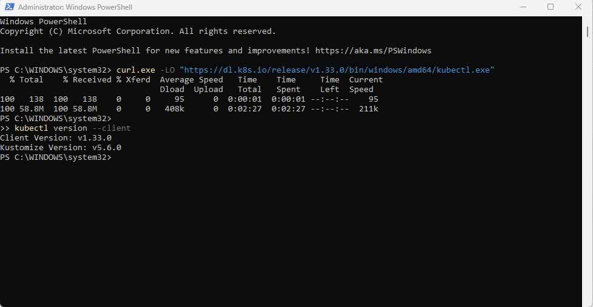
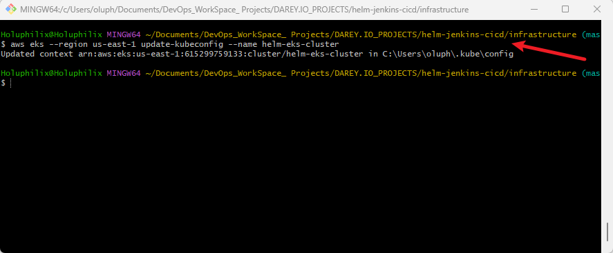
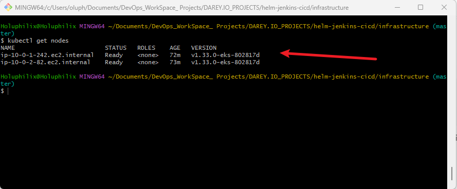
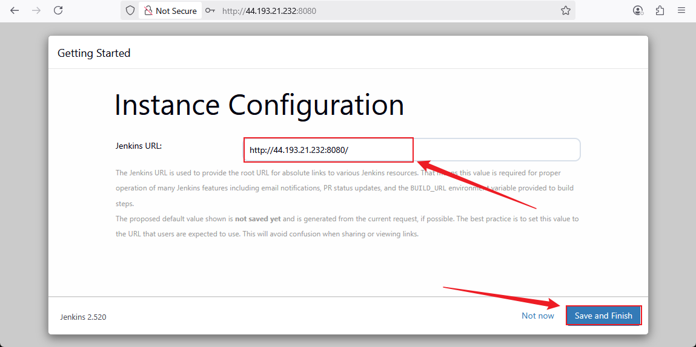
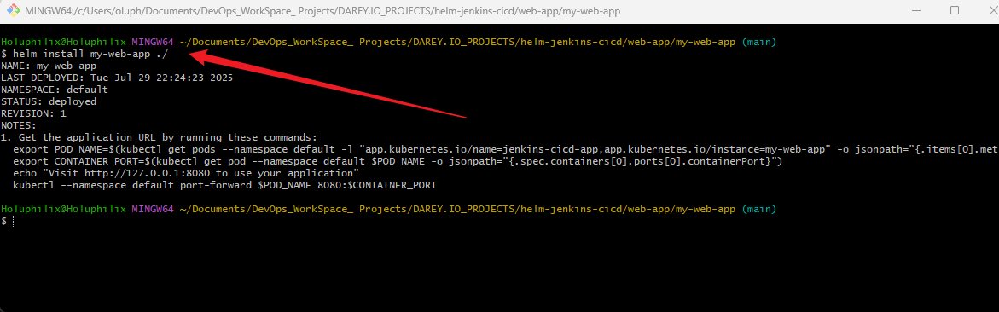
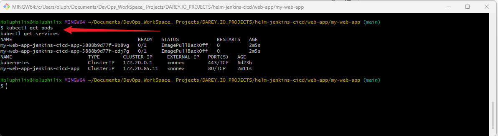
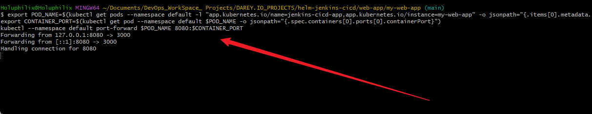
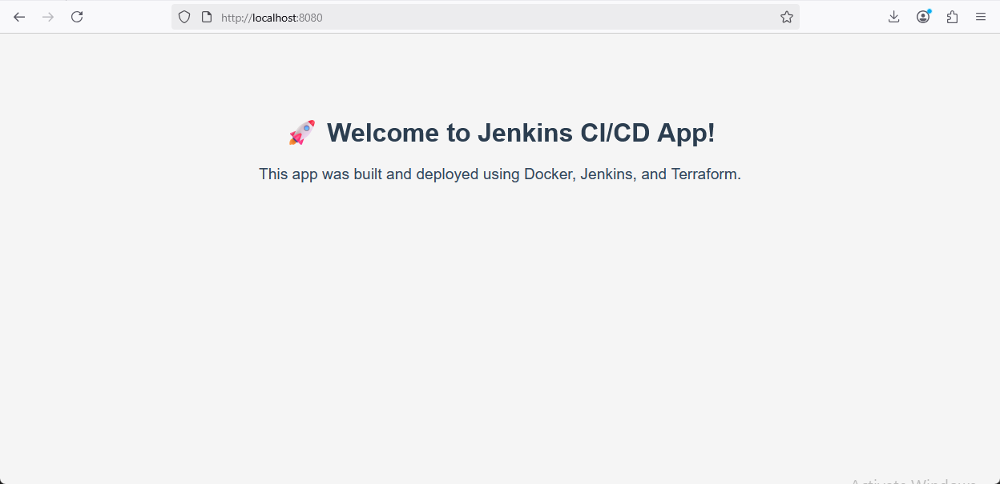
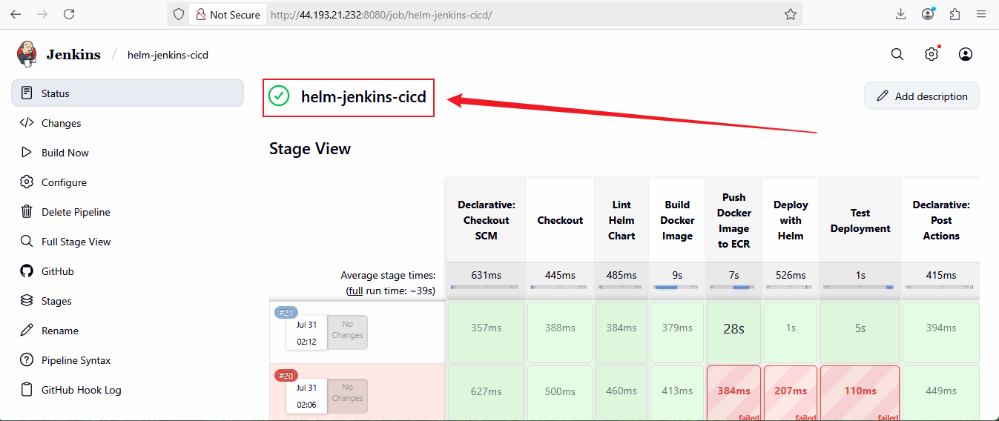
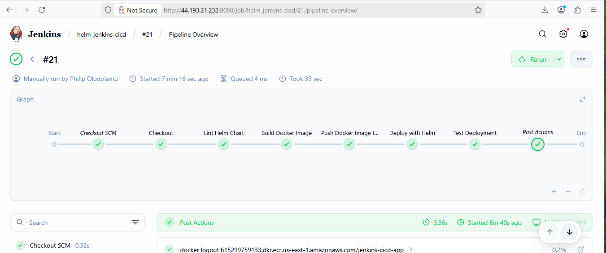

# 🧠 **Capstone Project: Configuration Management With Helm and Jenkins CI/CD Pipeline**

## 📘 **Project Scenario**

In today’s DevOps-driven world, streamlining application deployments and managing Kubernetes resources efficiently is crucial. This capstone project introduces you to **Helm**, the powerful package manager for Kubernetes, and demonstrates how to integrate it with **Jenkins**, a widely-used CI/CD automation tool.

As a **DevOps Engineer**, your mission is to design and implement a **simplified CI/CD pipeline** that uses **Helm charts** to automate the deployment of a **sample web application**. This project will help you solidify your understanding of modern DevOps tooling and give you hands-on experience with configuration management, infrastructure provisioning, and deployment automation.

## 🧩 **Project Goals and Objectives**

- Provision infrastructure using **Terraform** to host Jenkins.
- Install and configure **Jenkins** with required plugins and security settings.
- Learn the fundamentals of **Helm** and create a basic Helm chart.
- Automate application deployments using **Jenkins + Helm** integration.
- Demonstrate a full CI/CD workflow in a modular, beginner-friendly way.

##  🧩 **Prerequisites**

To successfully complete this project, you should have:

- Basic understanding of **Jenkins** and CI/CD concepts.
- Completion of the following foundational mini-projects:
  - *Introduction to Helm Charts*
  - *Working with Helm Charts*
- Access to a **Linux server** (e.g., AWS EC2 or local VM) for hosting Jenkins.
- A working **Terraform CLI** setup (installed and configured).
- Familiarity with **Git**, **Bash scripting**, and **Kubernetes** basics.

## 📦 **Project Deliverables**

### 📄 Documentation

- Structured setup guides for Jenkins, Helm, and CI/CD pipeline implementation.
- `user_data.sh` script for automated Jenkins provisioning.
- Clear documentation of Jenkins plugin configuration and security practices.
- Helm chart structure and deployment instructions.

### 🎥 Demonstration

- Walkthrough of:
  - Infrastructure provisioning with Terraform
  - Jenkins installation and configuration
  - Helm chart creation for a sample web app
  - CI/CD pipeline integration and automated deployment

## 🧱 **Project Components**

| Component                      | Description                                                             |
|-------------------------------|-------------------------------------------------------------------------|
| **Jenkins Server Setup**       | Provision a Jenkins host using Terraform and install Jenkins via script |
| **Helm Chart Basics**          | Understand Helm chart structure and create a chart for a web app        |
| **Working with Helm Charts**   | Deploy, customize, upgrade, and rollback applications using Helm        |
| **Integrating Helm & Jenkins** | Automate Helm deployments using Jenkins pipelines                       |

## 🧰 **Tools & Technologies Used**

| Category           | Tools / Technologies                           |
|--------------------|------------------------------------------------|
| CI/CD              | Jenkins, Git                                   |
| Infrastructure     | Terraform, AWS EC2                             |
| Configuration Mgmt | Helm, kubectl, YAML                            |
| Scripting          | Bash (`user_data.sh`)                          |
| Operating System   | Ubuntu 22.04 LTS                               |
| Optional           | Docker (for local `kind` testing, if used)     |

## 🏗️ **Infrastructure Setup with Terraform**

Terraform will be used to provision a Linux-based EC2 instance that runs Jenkins. The automation will:

- Create a dedicated **VPC**, **subnet**, and **security group**
- Launch an **EC2 instance** using Ubuntu 22.04 LTS AMI
- Attach a `user_data.sh` script to install:
  - Java & Jenkins
  - Git, Helm, kubectl
  - Docker (optional, for local container-based testing)

### 💡 Terraform Modules to Be Included

- `vpc/` — Custom Virtual Private Cloud with subnet and routing
- `security-group/` — Opens port 8080 for Jenkins access
- `ec2/` — Provisions EC2 with user data to install Jenkins and dependencies

## 🔧 **Task 1: Project Directory and Structure Setup**

### 🎯 **Objective**

Establish a clean, modular, and production-ready folder structure for the capstone project. This step lays the foundation for infrastructure provisioning, CI/CD with Jenkins, containerization with Docker, and Kubernetes deployment using Helm and Terraform modules.

### 📁 Step 1.1 — Create Project Root Directory

In your local workspace:

```bash
mkdir helm-jenkins-cicd
cd helm-jenkins-cicd
```

### 🗂️ Step 1.2 — Create Top-Level Project Directories

```bash
mkdir docs infrastructure jenkins-setup web-app
touch .gitignore Jenkinsfile README.md
```
### 📄 Step 1.3 — Create Subdirectories and Files for All Components

#### 🔧 Jenkins Setup

```bash
mkdir -p jenkins-setup
touch jenkins-setup/user_data.sh
```

#### 📦 Web App & Helm Chart

```bash
cd web-app
touch .dockerignore Dockerfile index.html
mkdir -p my-web-app/templates
touch my-web-app/.helmignore
touch my-web-app/Chart.yaml
touch my-web-app/values.yaml
touch my-web-app/templates/deployment.yaml
cd ..
```

#### 🛠️ Infrastructure (Terraform)

```bash
mkdir -p infrastructure/modules/{vpc,ec2,ecr,eks,iam,keypair,security-group}
touch infrastructure/main.tf
touch infrastructure/variables.tf
touch infrastructure/outputs.tf
touch infrastructure/terraform.tfvars

# Create base files for all modules
for module in vpc ec2 ecr eks iam keypair security-group; do
  touch infrastructure/modules/$module/main.tf
  touch infrastructure/modules/$module/variables.tf
  touch infrastructure/modules/$module/outputs.tf
done
```

#### 🖼️ Docs Folder

```bash
mkdir -p docs/images
```

### 📐 Step 1.4 — Final Project Structure Overview

```bash
helm-jenkins-cicd/
├── docs/
│   └── images/                          # Screenshots and diagrams
│
├── infrastructure/
│   ├── main.tf                          # Root Terraform configuration
│   ├── variables.tf
│   ├── outputs.tf
│   ├── terraform.tfvars                 # TF variables (not committed if sensitive)
│   └── modules/
│       ├── vpc/                         # VPC module
│       │   ├── main.tf
│       │   ├── variables.tf
│       │   └── outputs.tf
│       ├── ec2/                         # EC2 instance module
│       │   ├── main.tf
│       │   ├── variables.tf
│       │   └── outputs.tf
│       ├── ecr/                         # ECR (Elastic Container Registry) module
│       │   ├── main.tf
│       │   ├── variables.tf
│       │   └── outputs.tf
│       ├── eks/                         # EKS (Kubernetes) cluster module
│       │   ├── main.tf
│       │   ├── variables.tf
│       │   └── outputs.tf
│       ├── iam/                         # IAM roles/policies module
│       │   ├── main.tf
│       │   ├── variables.tf
│       │   └── outputs.tf
│       ├── keypair/                     # SSH key pair module
│       │   ├── main.tf
│       │   ├── variables.tf
│       │   └── outputs.tf
│       └── security-group/             # Security group module
│           ├── main.tf
│           ├── variables.tf
│           └── outputs.tf
│
├── jenkins-setup/
│   └── user_data.sh                     # Jenkins installation and configuration
│
├── web-app/
│   ├── .dockerignore
│   ├── Dockerfile
│   ├── index.html
│   └── my-web-app/                      # Helm chart directory
│       ├── .helmignore
│       ├── Chart.yaml
│       ├── values.yaml
│       └── templates/
│           └── deployment.yaml
│
├── .gitignore                           # Git ignore rules
├── Jenkinsfile                          # Jenkins pipeline configuration
└── README.md                            # Project documentation
```
### 📦 Component Summary

| Component         | Description                                                                 |
| ----------------- | --------------------------------------------------------------------------- |
| `docs/`           | Contains all project-related screenshots and architecture diagrams          |
| `infrastructure/` | Terraform root and modules for VPC, EC2, EKS, IAM, ECR, etc.                |
| `jenkins-setup/`  | Jenkins installation and setup using a user data script                     |
| `web-app/`        | Source code for Dockerized web application, Helm chart inside `my-web-app/` |
| `.gitignore`      | Specifies intentionally untracked files to ignore in Git                    |
| `Jenkinsfile`     | Defines the CI/CD pipeline using Jenkins                                    |
| `README.md`       | Markdown file documenting the entire project                                |

### 🔧 Tech Stack

* **CI/CD:** Jenkins
* **Infrastructure as Code:** Terraform (AWS EC2, EKS, ECR, IAM, VPC)
* **Containerization:** Docker
* **Kubernetes Deployment:** Helm, kubectl
* **Scripting:** Bash (`user_data.sh`)
* **Version Control:** Git & GitHub
* **OS:** Ubuntu 22.04 LTS

### 🔗 Key Integrations

* **Jenkins ↔ GitHub:** For webhook-triggered builds using `Jenkinsfile`
* **Jenkins ↔ Docker & Helm:** For image build, push, and deploy to Kubernetes
* **Helm ↔ EKS:** Deploy Helm charts to EKS-managed Kubernetes cluster
* **Terraform ↔ AWS:** Provision EKS, EC2, IAM roles, networking, and storage

## 🛠️ **Task 2: Infrastructure Provisioning with Terraform**

### 🎯 **Objective**

Provision a secure, production-like AWS environment using Terraform. This includes creating a VPC, public and private subnets, Internet Gateway, route table, security group, and an EC2 instance where Jenkins will be installed automatically via user_data.sh.

### 📦 **Terraform Modules Overview**

This task is broken down into the following modules inside `infrastructure/modules/`:

1. `vpc/` — Creates VPC, public/private subnets, IGW, and route table
2. `security-group/` –  Creates a security group allowing SSH, HTTP (optional), and Jenkins port (8080)
3. `ec2/` – Provisions EC2 instance with a specified AMI and attaches user_data.sh.
4. `keypair/` — Generates an EC2 key pair with private key saved locally.

### 🔹 **Step 2.1 — VPC Module**

### 📁 Directory: `infrastructure/modules/vpc/main.tf`

```hcl
resource "aws_vpc" "main" {
  cidr_block           = var.vpc_cidr
  enable_dns_support   = true
  enable_dns_hostnames = true

  tags = {
    Name = var.vpc_name
  }
}

resource "aws_internet_gateway" "gw" {
  vpc_id = aws_vpc.main.id

  tags = {
    Name = "${var.vpc_name}-igw"
  }
}

resource "aws_subnet" "public1" {
  vpc_id                  = aws_vpc.main.id
  cidr_block              = var.public_subnet_cidr_1
  availability_zone       = var.availability_zone_1
  map_public_ip_on_launch = true

  tags = {
    Name = "${var.vpc_name}-public-subnet-1"
  }
}

resource "aws_subnet" "public2" {
  vpc_id                  = aws_vpc.main.id
  cidr_block              = var.public_subnet_cidr_2
  availability_zone       = var.availability_zone_2
  map_public_ip_on_launch = true

  tags = {
    Name = "${var.vpc_name}-public-subnet-2"
  }
}

resource "aws_subnet" "private1" {
  vpc_id            = aws_vpc.main.id
  cidr_block        = var.private_subnet_cidr_1
  availability_zone = var.availability_zone_1
  map_public_ip_on_launch = false

  tags = {
    Name = "${var.vpc_name}-private-subnet-1"
  }
}

resource "aws_subnet" "private2" {
  vpc_id            = aws_vpc.main.id
  cidr_block        = var.private_subnet_cidr_2
  availability_zone = var.availability_zone_2
  map_public_ip_on_launch = false

  tags = {
    Name = "${var.vpc_name}-private-subnet-2"
  }
}

resource "aws_route_table" "public" {
  vpc_id = aws_vpc.main.id

  tags = {
    Name = "${var.vpc_name}-public-rt"
  }
}

resource "aws_route" "default_route" {
  route_table_id         = aws_route_table.public.id
  destination_cidr_block = "0.0.0.0/0"
  gateway_id             = aws_internet_gateway.gw.id
}

resource "aws_route_table_association" "public_assoc_1" {
  subnet_id      = aws_subnet.public1.id
  route_table_id = aws_route_table.public.id
}

resource "aws_route_table_association" "public_assoc_2" {
  subnet_id      = aws_subnet.public2.id
  route_table_id = aws_route_table.public.id
}
```

### `infrastructure/modules/vpc/variables.tf`

```hcl
variable "vpc_name" {
  description = "The name of the VPC"
  type        = string
}

variable "vpc_cidr" {
  description = "CIDR block for the VPC"
  type        = string
}

variable "public_subnet_cidr_1" {
  description = "CIDR block for the first public subnet"
  type        = string
}

variable "public_subnet_cidr_2" {
  description = "CIDR block for the second public subnet"
  type        = string
}

variable "private_subnet_cidr_1" {
  description = "CIDR block for the first private subnet"
  type        = string
}

variable "private_subnet_cidr_2" {
  description = "CIDR block for the second private subnet"
  type        = string
}

variable "availability_zone_1" {
  description = "Availability zone for the first subnet"
  type        = string
}

variable "availability_zone_2" {
  description = "Availability zone for the second subnet"
  type        = string
}
```

### `infrastructure/modules/vpc/outputs.tf`

```hcl
output "vpc_id" {
  description = "The ID of the VPC"
  value       = aws_vpc.main.id
}

output "public_subnet_1_id" {
  description = "ID of the first public subnet"
  value       = aws_subnet.public1.id
}

output "public_subnet_2_id" {
  description = "ID of the second public subnet"
  value       = aws_subnet.public2.id
}

output "public_subnet_ids" {
  description = "IDs of the public subnets"
  value       = [aws_subnet.public1.id, aws_subnet.public2.id]
}

output "private_subnet_1_id" {
  description = "ID of the first private subnet"
  value       = aws_subnet.private1.id
}

output "private_subnet_2_id" {
  description = "ID of the second private subnet"
  value       = aws_subnet.private2.id
}

output "private_subnet_ids" {
  description = "IDs of the private subnets"
  value       = [aws_subnet.private1.id, aws_subnet.private2.id]
}
```

### 🔒 **Step 2.2 — Security Group Module**

### 📁 Directory: `infrastructure/modules/security-group/`

### 📄 `main.tf`

```hcl
resource "aws_security_group" "jenkins_sg" {
  name        = "${var.environment}-jenkins-sg"
  description = "Allow SSH and Jenkins traffic"
  vpc_id      = var.vpc_id

  ingress {
    description = "Allow SSH"
    from_port   = 22
    to_port     = 22
    protocol    = "tcp"
    cidr_blocks = var.allowed_cidrs
  }

  ingress {
    description = "Allow HTTP"
    from_port   = 80
    to_port     = 80
    protocol    = "tcp"
    cidr_blocks = var.allowed_cidrs
  }

  ingress {
    description = "Allow Jenkins UI"
    from_port   = 8080
    to_port     = 8080
    protocol    = "tcp"
    cidr_blocks = var.allowed_cidrs
  }

  egress {
    description = "Allow all outbound traffic"
    from_port   = 0
    to_port     = 0
    protocol    = "-1"
    cidr_blocks = ["0.0.0.0/0"]
  }

  tags = {
    Name = "${var.environment}-jenkins-sg"
  }
}
```

### 📄 `variables.tf`

```hcl
variable "vpc_id" {
  description = "VPC ID to associate with the security group"
  type        = string
}

variable "allowed_cidrs" {
  description = "List of CIDR blocks to allow access from"
  type        = list(string)
  default     = ["0.0.0.0/0"]  # Update this for production
}

variable "environment" {
  description = "Project environment (e.g., dev, staging)"
  type        = string
}
```

### 📄 `outputs.tf`

```hcl
output "security_group_id" {
  value = aws_security_group.jenkins_sg.id
}
```

### 🚀 **Step 2.3 — EC2 Module**

### 📁 Directory: `infrastructure/modules/ec2/`

### 📄 `main.tf`

```hcl
resource "aws_instance" "jenkins_server" {
  ami                    = var.ami_id
  instance_type          = var.instance_type
  subnet_id              = var.subnet_id
  vpc_security_group_ids = [var.security_group_id]
  key_name               = var.key_name
  user_data              = file(var.user_data_path)

  tags = {
    Name = "${var.environment}-jenkins-server"
  }
}

resource "aws_eip" "jenkins_eip" {
  instance = aws_instance.jenkins_server.id
  tags = {
    Name = "${var.environment}-jenkins-eip"
  }
}
```

### 📄 `variables.tf`

```hcl
variable "ami_id" {
  description = "AMI ID for the EC2 instance"
  type        = string
}

variable "instance_type" {
  description = "EC2 instance type"
  type        = string
}

variable "subnet_id" {
  description = "Subnet ID where the instance will be deployed"
  type        = string
}

variable "security_group_id" {
  description = "Security group ID to associate with the EC2 instance"
  type        = string
}

variable "key_name" {
  description = "Key pair name for SSH access"
  type        = string
}

variable "user_data_path" {
  description = "Path to the user data script file"
  type        = string
}

variable "environment" {
  description = "Environment name (e.g., dev, prod)"
  type        = string
}
```

### 📄 `outputs.tf`

```hcl
output "public_ip" {
  description = "Public IP address of the EC2 instance"
  value       = aws_instance.jenkins_server.public_ip
}

output "instance_id" {
  description = "EC2 Instance ID"
  value       = aws_instance.jenkins_server.id
}

output "elastic_ip" {
  value = aws_eip.jenkins_eip.public_ip
}
```

### 🔐 **Step 2.4 — Key Pair Module**

### 📁 Directory: `infrastructure/modules/keypair/`

This module will create an AWS EC2 key pair and optionally save the private key locally or as a Terraform output (depending on security preferences).

### 📄 `main.tf`

```hcl
resource "tls_private_key" "jenkins_key" {
  algorithm = "RSA"
  rsa_bits  = 4096
}

resource "aws_key_pair" "jenkins_key" {
  key_name   = var.key_name
  public_key = tls_private_key.jenkins_key.public_key_openssh
}

resource "local_file" "private_key_pem" {
  content  = tls_private_key.jenkins_key.private_key_pem
  filename = "${path.module}/jenkins-key.pem"
  file_permission = "0400"
}
```

### 📄 `variables.tf`

```hcl
variable "key_name" {
  description = "Name to assign to the AWS key pair"
  type        = string
}
```

### 📄 `outputs.tf`

```hcl
output "key_name" {
  value = aws_key_pair.jenkins_key.key_name
}

output "private_key_path" {
  value = local_file.private_key_pem.filename
  description = "Path to the saved private key file"
}
```

### 📌 Important Note

The `.pem` file is saved as:

```bash
infrastructure/modules/keypair/jenkins-key.pem
```

You can SSH into the EC2 instance like:

```bash
chmod 400 jenkins-key.pem
ssh -i jenkins-key.pem ubuntu@<jenkins_public_ip>
```

### 🗂️ **Step 2.5: Root Terraform Configuration**

### 📁 Directory: `infrastructure/`
Files: `main.tf`, `variables.tf`, `outputs.tf`, `terraform.tfvars`

### 📄 `main.tf`

```hcl
provider "aws" {
  region = var.aws_region
}

module "vpc" {
  source = "./modules/vpc"

  vpc_name            = var.vpc_name
  vpc_cidr            = var.vpc_cidr

  public_subnet_cidr_1  = var.public_subnet_cidr_1
  public_subnet_cidr_2  = var.public_subnet_cidr_2

  private_subnet_cidr_1 = var.private_subnet_cidr_1
  private_subnet_cidr_2 = var.private_subnet_cidr_2

  availability_zone_1   = var.availability_zone_1
  availability_zone_2   = var.availability_zone_2
}

module "security_group" {
  source         = "./modules/security-group"
  vpc_id         = module.vpc.vpc_id
  environment    = var.environment
  allowed_cidrs  = var.allowed_cidrs
}

module "keypair" {
  source   = "./modules/keypair"
  key_name = var.key_name
}

module "ec2" {
  source             = "./modules/ec2"
  ami_id             = var.ami_id
  instance_type      = var.instance_type
  subnet_id          = module.vpc.public_subnet_ids[0]
  security_group_id  = module.security_group.security_group_id
  key_name           = module.keypair.key_name
  user_data_path     = "${path.module}/../jenkins-setup/user_data.sh"
  environment        = var.environment
}
```

### 📄 `variables.tf`

```hcl
variable "aws_region" {
  description = "AWS Region"
  type        = string
  default     = "us-east-1"
}

variable "environment" {
  description = "Deployment environment"
  type        = string
  default     = "dev"
}

variable "vpc_name" {
  description = "The name of the VPC."
  type        = string
}

variable "vpc_cidr" {
  description = "CIDR block for the VPC"
  type        = string
  default     = "10.0.0.0/16"
}

variable "public_subnet_cidr_1" {
  description = "CIDR block for the first public subnet"
  type        = string
  default     = "10.0.1.0/24"
}

variable "public_subnet_cidr_2" {
  description = "CIDR block for the second public subnet"
  type        = string
  default     = "10.0.2.0/24"
}

variable "private_subnet_cidr_1" {
  description = "CIDR block for the first private subnet"
  type        = string
  default     = "10.0.3.0/24"
}

variable "private_subnet_cidr_2" {
  description = "CIDR block for the second private subnet"
  type        = string
  default     = "10.0.4.0/24"
}

variable "availability_zone_1" {
  description = "First availability zone"
  type        = string
  default     = "us-east-1a"
}

variable "availability_zone_2" {
  description = "Second availability zone"
  type        = string
  default     = "us-east-1b"
}

variable "ami_id" {
  description = "AMI ID for EC2 instances"
  type        = string
  default     = "ami-020cba7c55df1f615"
}

variable "instance_type" {
  description = "EC2 instance type"
  type        = string
  default     = "t3.medium"
}

variable "key_name" {
  description = "EC2 key pair name"
  type        = string
  default     = "jenkins-key"
}

variable "allowed_cidrs" {
  description = "CIDRs allowed for security group inbound"
  type        = list(string)
  default     = ["78.135.30.254/32"]
}
```

### 📄 `outputs.tf`

```hcl
output "vpc_id" {
  description = "The ID of the created VPC"
  value       = module.vpc.vpc_id
}

output "public_subnet_ids" {
  description = "List of public subnet IDs"
  value       = module.vpc.public_subnet_ids
}

output "private_subnet_ids" {
  description = "List of private subnet IDs"
  value       = module.vpc.private_subnet_ids
}

output "security_group_id" {
  description = "The ID of the created security group"
  value       = module.security_group.security_group_id
}

output "ec2_instance_id" {
  description = "ID of the EC2 instance"
  value       = module.ec2.instance_id
}

output "jenkins_elastic_ip" {
  description = "Elastic IP attached to Jenkins EC2 instance"
  value       = module.ec2.elastic_ip
}

output "keypair_name" {
  description = "Name of the generated key pair"
  value       = module.keypair.key_name
}

output "private_key_path" {
  description = "Path to the locally stored private key"
  value       = module.keypair.private_key_path
}
```

### 📄  `infrastructure/terraform.tfvars`

```hcl
project_name        = "helm-jenkins-cicd"
aws_region          = "us-east-1"
environment         = "dev"

vpc_name            = "helm-jenkins-cicd-vpc"
vpc_cidr            = "10.0.0.0/16"

# Updated to include two public subnets
public_subnet_cidr_1  = "10.0.1.0/24"
public_subnet_cidr_2  = "10.0.2.0/24"

private_subnet_cidr_1 = "10.0.3.0/24"
private_subnet_cidr_2 = "10.0.4.0/24"

availability_zone_1   = "us-east-1a"
availability_zone_2   = "us-east-1b"

ami_id              = "ami-020cba7c55df1f615"
instance_type       = "t3.medium"
key_name            = "jenkins-key"
allowed_cidrs       = ["0.0.0.0/0"]
```
 
### 📁 **Step 2.6: .gitignore Configuration**

To ensure only relevant files are committed to Git, the following `.gitignore` file was created at the root of the project:

```bash
# Node modules and log files
node_modules/
*.log

# Build output
dist/
build/

# Environment files
.env

# IDE and OS-specific files
.vscode/
.DS_Store

# Terraform state files (if applicable)
*.tfstate
*.tfstate.backup

# Docker
*.tar
```

### **Step 2.7: Terraform Configuration Commands**

**After configuring, simply run:**

```bash
terraform init
terraform plan
terraform apply
```

## 📘 **Task 3: IAM Role Module for Jenkins EC2**

This task creates a **modular and reusable IAM configuration** using Terraform. The role grants a **Jenkins EC2 instance** permissions to interact with AWS services such as **EKS**, **ECR**, and **SSM**.

### 📁 Folder Structure

IAM configuration resides in its own module folder:

```
infrastructure/
└── modules/
    └── iam/
        ├── main.tf
        ├── variables.tf
        └── outputs.tf
```

### 🛠️ **What It Does**

* Provisions **three IAM roles**:

  1. EKS Cluster Role (for control plane)
  2. EKS Node Role (for worker nodes)
  3. Jenkins EC2 Role (to interact with EKS, ECR, and SSM)
* Attaches required policies
* Creates **IAM instance profile** for Jenkins

### ✅ `main.tf`

```hcl
# EKS Cluster Role
resource "aws_iam_role" "eks_cluster" {
  name = "eks-cluster-role"

  assume_role_policy = jsonencode({
    Version = "2012-10-17",
    Statement = [
      {
        Effect = "Allow",
        Principal = {
          Service = "eks.amazonaws.com"
        },
        Action = "sts:AssumeRole"
      }
    ]
  })
}

resource "aws_iam_role_policy_attachment" "eks_cluster_policy" {
  role       = aws_iam_role.eks_cluster.name
  policy_arn = "arn:aws:iam::aws:policy/AmazonEKSClusterPolicy"
}

# EKS Node Role
resource "aws_iam_role" "eks_node" {
  name = "eks-node-role"

  assume_role_policy = jsonencode({
    Version = "2012-10-17",
    Statement = [
      {
        Effect = "Allow",
        Principal = {
          Service = "ec2.amazonaws.com"
        },
        Action = "sts:AssumeRole"
      }
    ]
  })
}

resource "aws_iam_role_policy_attachment" "node_worker_policy" {
  role       = aws_iam_role.eks_node.name
  policy_arn = "arn:aws:iam::aws:policy/AmazonEKSWorkerNodePolicy"
}

resource "aws_iam_role_policy_attachment" "node_cni_policy" {
  role       = aws_iam_role.eks_node.name
  policy_arn = "arn:aws:iam::aws:policy/AmazonEKS_CNI_Policy"
}

resource "aws_iam_role_policy_attachment" "node_ecr_readonly" {
  role       = aws_iam_role.eks_node.name
  policy_arn = "arn:aws:iam::aws:policy/AmazonEC2ContainerRegistryReadOnly"
}

# Jenkins Role for EC2
resource "aws_iam_role" "jenkins" {
  name = var.role_name

  assume_role_policy = jsonencode({
    Version = "2012-10-17",
    Statement = [
      {
        Effect = "Allow",
        Principal = {
          Service = "ec2.amazonaws.com"
        },
        Action = "sts:AssumeRole"
      }
    ]
  })
}

resource "aws_iam_role_policy_attachment" "jenkins_eks_cluster" {
  role       = aws_iam_role.jenkins.name
  policy_arn = "arn:aws:iam::aws:policy/AmazonEKSClusterPolicy"
}

resource "aws_iam_role_policy_attachment" "jenkins_eks_worker" {
  role       = aws_iam_role.jenkins.name
  policy_arn = "arn:aws:iam::aws:policy/AmazonEKSWorkerNodePolicy"
}

resource "aws_iam_role_policy_attachment" "jenkins_ecr_full" {
  role       = aws_iam_role.jenkins.name
  policy_arn = "arn:aws:iam::aws:policy/AmazonEC2ContainerRegistryFullAccess"
}

resource "aws_iam_role_policy_attachment" "jenkins_ssm" {
  role       = aws_iam_role.jenkins.name
  policy_arn = "arn:aws:iam::aws:policy/AmazonSSMManagedInstanceCore"
}

resource "aws_iam_instance_profile" "jenkins_profile" {
  name = "${var.role_name}-instance-profile"
  role = aws_iam_role.jenkins.name
}
```

### ✅ `variables.tf`

```hcl
variable "role_name" {
  description = "IAM role name for Jenkins EC2 instance"
  type        = string
  default     = "jenkins-iam-role"
}
```

### ✅ `outputs.tf`

```hcl
output "eks_cluster_role_arn" {
  description = "IAM Role ARN for EKS Cluster"
  value       = aws_iam_role.eks_cluster.arn
}

output "eks_node_role_arn" {
  description = "IAM Role ARN for EKS Worker Nodes"
  value       = aws_iam_role.eks_node.arn
}

output "jenkins_role_arn" {
  description = "IAM Role ARN for Jenkins EC2"
  value       = aws_iam_role.jenkins.arn
}

output "jenkins_instance_profile" {
  description = "IAM Instance Profile for Jenkins EC2"
  value       = aws_iam_instance_profile.jenkins_profile.name
}
```

### ✅ Usage in Root `infrastructure/main.tf`

```hcl
module "iam" {
  source    = "./modules/iam"
  role_name = "jenkins-eks-role"
}
```

### 🧪 Run It

```bash
cd infrastructure
terraform init
terraform apply
```

## 🧩 **Task 4: Provision an Amazon EKS Cluster with IAM Roles using Terraform**

### 🎯 **Objective**

* Create a fully functional EKS Kubernetes cluster.
* Setup IAM roles for the EKS cluster and worker nodes.
* Connect EKS cluster networking with your existing VPC.
* Output essential EKS cluster details for integration.

### 1️⃣ **Create EKS Terraform Module**

Create the folder structure:

```
infrastructure/modules/eks/
```

Inside this folder, create the following files:

### 2️⃣ **`main.tf`**

```hcl
resource "aws_eks_cluster" "eks" {
  name     = var.cluster_name
  role_arn = var.cluster_role_arn

  vpc_config {
    subnet_ids         = var.subnet_ids
    security_group_ids = [aws_security_group.eks_sg.id]
  }
}

resource "aws_eks_node_group" "eks_nodes" {
  cluster_name    = aws_eks_cluster.eks.name
  node_group_name = "${var.cluster_name}-node-group"
  node_role_arn   = var.node_role_arn
  subnet_ids      = var.subnet_ids

  scaling_config {
    desired_size = 2
    max_size     = 3
    min_size     = 1
  }

  instance_types = [var.node_instance_type]

  depends_on = [
    aws_eks_cluster.eks
  ]
}

data "aws_eks_cluster_auth" "eks" {
  name = aws_eks_cluster.eks.name
}

provider "kubernetes" {
  host                   = aws_eks_cluster.eks.endpoint
  cluster_ca_certificate = base64decode(aws_eks_cluster.eks.certificate_authority[0].data)
  token                  = data.aws_eks_cluster_auth.eks.token
}

resource "kubernetes_config_map" "aws_auth" {
  metadata {
    name      = "aws-auth"
    namespace = "kube-system"
  }

  data = {
    mapRoles = jsonencode([
      {
        rolearn  = var.node_role_arn
        username = "system:node:{{EC2PrivateDNSName}}"
        groups   = ["system:bootstrappers", "system:nodes"]
      },
      {
        rolearn  = "arn:aws:iam::615299759133:role/Jenkin-eks-role"
        username = "jenkin-eks-role"
        groups   = ["system:masters"]
      }
    ])

    mapUsers = jsonencode([
      {
        userarn  = "arn:aws:iam::615299759133:user/jenkins-eks-user"
        username = "jenkins-eks-user"
        groups   = ["system:masters"]
      }
    ])
  }

  depends_on = [aws_eks_node_group.eks_nodes]
}
```

### 3️⃣ **`variables.tf`**

```hcl
variable "aws_region" {
  description = "The AWS region to deploy resources"
  type        = string
  default     = "us-east-1"
}

variable "cluster_name" {
  description = "Name of the EKS cluster"
  type        = string
}

variable "subnet_ids" {
  description = "List of subnet IDs"
  type        = list(string)
}

variable "vpc_id" {
  description = "VPC ID for the EKS cluster (optional)"
  type        = string
  default     = ""
}

variable "node_instance_type" {
  description = "Instance type for worker nodes"
  type        = string
  default     = "t3.medium"
}

variable "eks_security_group_id" {
  description = "Security Group ID for EKS cluster"
  type        = string
}

variable "cluster_role_arn" {
  description = "ARN of the IAM role for EKS cluster"
  type        = string
}

variable "node_role_arn" {
  description = "ARN of the IAM role for EKS node group"
  type        = string
}
```

### 4️⃣ **`outputs.tf`**

```hcl
output "cluster_name" {
  description = "The name of the EKS cluster"
  value       = aws_eks_cluster.eks.name
}

output "cluster_endpoint" {
  description = "The endpoint URL of the EKS cluster"
  value       = aws_eks_cluster.eks.endpoint
}

output "cluster_security_group_id" {
  description = "Security group ID attached to the EKS cluster"
  value       = var.eks_security_group_id
}

output "node_group_name" {
  description = "The name of the EKS node group"
  value       = aws_eks_node_group.eks_nodes.node_group_name
}


output "eks_security_group_id" {
  value = aws_security_group.eks_sg.id
}
```

### **`security_groups.tf`**

```hcl
resource "aws_security_group" "eks_sg" {
  name        = "eks-cluster-sg"
  description = "Security group for EKS cluster communication"
  vpc_id      = var.vpc_id

  ingress {
    description = "Allow all within VPC"
    from_port   = 0
    to_port     = 0
    protocol    = "-1"
    cidr_blocks = ["10.0.0.0/16"] # Update based on your VPC CIDR
  }

  egress {
    from_port   = 0
    to_port     = 0
    protocol    = "-1"
    cidr_blocks = ["0.0.0.0/0"]
  }
}
```

### 5️⃣ **Integrate EKS Module in Your Root Terraform**

In your root `infrastructure/main.tf`, add:

```hcl
module "eks" {
  source                = "./modules/eks"
  cluster_name          = "helm-eks-cluster"
  vpc_id                = module.vpc.vpc_id
  subnet_ids            = module.vpc.public_subnet_ids  
  node_instance_type    = "t3.medium"
  eks_security_group_id = module.security_group.security_group_id

  cluster_role_arn      = module.iam.eks_cluster_role_arn
  node_role_arn         = module.iam.eks_node_role_arn
}
```

Declare variables in `variables.tf` at root:

```hcl
variable "node_desired_capacity" {
  description = "Desired EKS worker node count"
  type        = number
  default     = 2
}

variable "node_min_capacity" {
  description = "Minimum EKS worker node count"
  type        = number
  default     = 1
}

variable "node_max_capacity" {
  description = "Maximum EKS worker node count"
  type        = number
  default     = 3
}

variable "node_instance_types" {
  description = "List of EC2 instance types for EKS workers"
  type        = list(string)
  default     = ["t3.medium"]
}
```

### 6️⃣ **Run Terraform to Provision EKS**

```bash
terraform init
terraform plan
terraform apply
```

### 7️⃣ **Verify**
* After apply, note the cluster endpoint from output.

*Installation of `kubectl` on my local system:

**Screenshot:** Installed Kubectl


* You can update your `kubeconfig` using AWS CLI:

```bash
aws eks --region us-east-1 update-kubeconfig --name helm-eks-cluster
```

**Screenshot:** Kubeconfig


* Verify cluster access:

```bash
kubectl get nodes
```

**Screenshot:** Kubectl get nodes


### Summary Table

| Step                | Description                                  |
| ------------------- | -------------------------------------------- |
| IAM Roles           | Create roles for EKS cluster & worker nodes  |
| EKS Cluster Module  | Use `terraform-aws-modules/eks/aws` module   |
| Variables & Outputs | Define inputs and expose key outputs         |
| Root Integration    | Call EKS module from root with VPC & subnets |
| Terraform Apply     | Provision resources on AWS                   |
| Verify Kubernetes   | Confirm cluster is up & nodes are ready      |


## 🔧 **Task 5: Jenkins Server Setup**

### 🎯 **Objective**

Automate the installation and configuration of Jenkins on an AWS EC2 instance using a `user_data.sh` script. This establishes the foundation of your CI/CD pipeline by ensuring Jenkins is fully operational with essential tools and plugins immediately upon instance launch.

### 📝 **Step 5.1 — Write the `user_data.sh` Script**

Create the script at:

```bash
jenkins-setup/user_data.sh
```

Paste the following content inside:

```bash
#!/bin/bash
set -e
exec > /var/log/user-data.log 2>&1

echo "Starting system update..."
apt-get update -y
apt-get upgrade -y

echo "Installing OpenJDK 17..."
apt-get install -y openjdk-17-jdk

echo "Adding Jenkins repo and installing Jenkins..."
curl -fsSL https://pkg.jenkins.io/debian-stable/jenkins.io-2023.key | tee /usr/share/keyrings/jenkins-keyring.asc > /dev/null
echo "deb [signed-by=/usr/share/keyrings/jenkins-keyring.asc] https://pkg.jenkins.io/debian-stable binary/" | tee /etc/apt/sources.list.d/jenkins.list
apt-get update -y
apt-get install -y jenkins
systemctl daemon-reload
systemctl start jenkins
systemctl enable jenkins

echo "Installing prerequisites for Docker..."
apt-get install -y apt-transport-https ca-certificates curl software-properties-common gnupg2

echo "Adding Docker GPG key and repo..."
mkdir -p /etc/apt/keyrings
curl -fsSL https://download.docker.com/linux/ubuntu/gpg | gpg --dearmor -o /etc/apt/keyrings/docker.gpg

echo \
  "deb [arch=amd64 signed-by=/etc/apt/keyrings/docker.gpg] https://download.docker.com/linux/ubuntu focal stable" | \
  tee /etc/apt/sources.list.d/docker.list > /dev/null

apt-get update -y
echo "Installing Docker CE..."
apt-get install -y docker-ce docker-ce-cli containerd.io

echo "Adding 'ubuntu' and 'jenkins' users to docker group..."
usermod -aG docker ubuntu
usermod -aG docker jenkins

systemctl start docker
systemctl enable docker

echo "Installing kubectl v1.30.0..."
KUBECTL_VERSION="v1.30.0"
for i in {1..5}; do
    curl -LO "https://dl.k8s.io/release/${KUBECTL_VERSION}/bin/linux/amd64/kubectl" && break || sleep 5
done
chmod +x kubectl
mv kubectl /usr/local/bin/
kubectl version --client

echo "Installing Helm..."
for i in {1..5}; do
    curl -fsSL -o get_helm.sh https://raw.githubusercontent.com/helm/helm/main/scripts/get-helm-3 && break || sleep 5
done
chmod 700 get_helm.sh
./get_helm.sh
helm version
rm -f get_helm.sh

if [ -d /home/ubuntu/.kube ]; then
    chown -R ubuntu:ubuntu /home/ubuntu/.kube
fi

echo "Installing AWS CLI..."
apt-get install -y unzip
curl -fsSL -o awscliv2.zip "https://awscli.amazonaws.com/awscli-exe-linux-x86_64.zip"
unzip awscliv2.zip
./aws/install
rm -rf awscliv2.zip aws

echo "Fixing permissions for Jenkins directories..."
chown -R jenkins:jenkins /var/lib/jenkins
chown -R jenkins:jenkins /var/cache/jenkins
chown -R jenkins:jenkins /var/log/jenkins
chown -R ubuntu:ubuntu /home/ubuntu/.kube

echo "Jenkins, Docker, Helm, kubectl, and AWS CLI installation completed successfully!"
```

### 🚀 **Step 5.2 — Launch the Infrastructure**

From the `infrastructure/` directory, run:

```bash
terraform init
terraform plan
terraform apply
```

After a few minutes, you’ll get output like:

```bash
jenkins_public_ip = "44.193.21.232"
```

Visit Jenkins in your browser:

```
http://44.193.21.232:8080/
```


### 🔐 **Step 5.3 — Jenkins Access Notes**

Once the EC2 instance is up, access Jenkins at:

```
http://44.193.21.232:8080/
```

#### 📸 Screenshot: Display Login Portal


To retrieve the **initial admin password**, run:

```bash
sudo cat /var/lib/jenkins/secrets/initialAdminPassword
```

Use this password to unlock Jenkins in the web UI.

#### 📸 Screenshot: Initial Admin Password


Then proceed to install required plugins and create your first CI/CD pipeline.

### 🔌 **Step 5.4 — Recommended Jenkins Plugins**

Install Essential Plugins manually via the web UI:

**Go to Manage Jenkins → Plugins → Available Plugins**

Search and Install:

- Git plugin (For source code management)

- Pipeline plugin (for CI/CD automation)

- Docker Pipeline plugin

- Kubernetes CLI Plugin (for Helm & Kubernetes)

- AWS Credentials

- AWS Steps Plugin

- Credentials Binding Plugin (for secure credentials management)

### 🔌 **Step 5.5: Restart Jenkins after installing plugins:**

```bash
sudo systemctl restart jenkins
sudo systemctl status jenkins
```

### 🔌 **Step 5.6: Check installations:**

```bash
java -version  
jenkins --version  
docker --version  
kubectl version --client  
helm version 
aws --version 
```

## ✅ **Task 6: Helm Chart Integration for Kubernetes Deployment**

### 📌 **Objective**

To containerize and deploy the dynamic web application using **Helm**, the Kubernetes package manager. This task involves creating and structuring the Helm chart for the web application and preparing it for deployment on the EKS cluster using Helm.

### 🗂️ **Directory Structure**

The `web-app` directory contains the main source files and the Helm chart. The project is structured as follows:

```bash
web-app/
├── .dockerignore
├── Dockerfile
├── index.html
├── my-web-app/
│   ├── .helmignore
│   ├── Chart.yaml
│   ├── values.yaml
│   ├── templates/
│   │   ├── deployment.yaml
│   │   ├── service.yaml
│   │   └── _helpers.tpl
```

### 🛠️ **Steps Implemented**

#### 1. ✅ Created the Helm Chart

You created a Helm chart using the following command inside `web-app`:

```bash
helm create my-web-app
```

This auto-generated the necessary boilerplate inside `web-app/my-web-app`.

This generates a my-web-app directory with:

- **Chart.yaml:** Metadata about the chart

- **values.yaml:** Default configuration values

- **templates/:** Kubernetes manifest templates

- **.helmignore:** Files to ignore during packaging

#### 2. ✍️ Modified `Chart.yaml`

The `Chart.yaml` file was updated with metadata to reflect the project:

```yaml
aapiVersion: v2
name: jenkins-cicd-app
version: 0.1.0
description: A simple Helm chart for my Jenkins CI/CD web app
appVersion: "1.0"
```

#### 3. ✍️ Customized `values.yaml`

The default values were adjusted to fit the Docker image and application specs:

```yaml
# Default values for my-web-app.
# This is a YAML-formatted file.
# Declare variables to be passed into your templates.

replicaCount: 2

image:
  repository: 615299759133.dkr.ecr.us-east-1.amazonaws.com/jenkins-cicd-app
  tag: "latest"
  pullPolicy: IfNotPresent

imagePullSecrets: []

nameOverride: ""
fullnameOverride: ""

serviceAccount:
  create: true
  automount: true
  annotations: {}
  name: ""

podAnnotations: {}

podLabels: {}

podSecurityContext: {}

securityContext: {}

service:
  type: ClusterIP
  port: 3000    # Updated from 80 to 3000

ingress:
  enabled: false
  className: ""
  annotations:
    # kubernetes.io/ingress.class: nginx
    # kubernetes.io/tls-acme: "true"
  hosts:
    - host: chart-example.local
      paths:
        - path: /
          pathType: ImplementationSpecific
  tls: []

resources:
  limits:
    cpu: 200m
    memory: 256Mi
  requests:
    cpu: 120m
    memory: 180Mi

livenessProbe:
  httpGet:
    path: /
    port: 3000    # Updated from 80 to 3000
  initialDelaySeconds: 10
  periodSeconds: 10
  timeoutSeconds: 5
  failureThreshold: 3
  successThreshold: 1

readinessProbe:
  httpGet:
    path: /
    port: 3000    # Updated from 80 to 3000
  initialDelaySeconds: 5
  periodSeconds: 10
  timeoutSeconds: 5
  failureThreshold: 3
  successThreshold: 1

autoscaling:
  enabled: false
  minReplicas: 1
  maxReplicas: 100
  targetCPUUtilizationPercentage: 80

volumes: []

volumeMounts: []

nodeSelector: {}

tolerations: []

affinity: {}
```
#### Helm Templating Basics:

**Templates:** Use Go templating syntax (e.g., {{ .Values.image.repository }}).

**Values:** values.yaml provides defaults, override via CLI or custom values file.

**Modifying Charts:**

Update values.yaml for configuration changes (e.g., replicaCount, image.tag).

Edit templates in templates/ for structural changes.

Use helm lint to validate the chart.

#### 4. 🧱 Updated Helm Templates

##### `deployment.yaml`

The default deployment was modified to match the correct image and container port using `values.yaml`:

```yaml
apiVersion: apps/v1
kind: Deployment
metadata:
  name: {{ include "my-web-app.fullname" . }}
  labels:
    {{- include "my-web-app.labels" . | nindent 4 }}
spec:
  {{- if not .Values.autoscaling.enabled }}
  replicas: {{ .Values.replicaCount }}
  {{- end }}
  selector:
    matchLabels:
      {{- include "my-web-app.selectorLabels" . | nindent 6 }}
  template:
    metadata:
      {{- with .Values.podAnnotations }}
      annotations:
        {{- toYaml . | nindent 8 }}
      {{- end }}
      labels:
        {{- include "my-web-app.labels" . | nindent 8 }}
        {{- with .Values.podLabels }}
        {{- toYaml . | nindent 8 }}
        {{- end }}
    spec:
      {{- with .Values.imagePullSecrets }}
      imagePullSecrets:
        {{- toYaml . | nindent 8 }}
      {{- end }}
      serviceAccountName: {{ include "my-web-app.serviceAccountName" . }}
      {{- with .Values.podSecurityContext }}
      securityContext:
        {{- toYaml . | nindent 8 }}
      {{- end }}
      containers:
        - name: {{ .Chart.Name }}
          {{- with .Values.securityContext }}
          securityContext:
            {{- toYaml . | nindent 12 }}
          {{- end }}
          image: "{{ .Values.image.repository }}:{{ .Values.image.tag }}"
          imagePullPolicy: {{ .Values.image.pullPolicy }}
          ports:
            - name: http
              containerPort: {{ .Values.service.port }}
              protocol: TCP
          {{- with .Values.livenessProbe }}
          livenessProbe:
            {{- toYaml . | nindent 12 }}
          {{- end }}
          {{- with .Values.readinessProbe }}
          readinessProbe:
            {{- toYaml . | nindent 12 }}
          {{- end }}
          {{- with .Values.resources }}
          resources:
            {{- toYaml . | nindent 12 }}
          {{- end }}
          {{- with .Values.volumeMounts }}
          volumeMounts:
            {{- toYaml . | nindent 12 }}
          {{- end }}
      {{- with .Values.volumes }}
      volumes:
        {{- toYaml . | nindent 8 }}
      {{- end }}
      {{- with .Values.nodeSelector }}
      nodeSelector:
        {{- toYaml . | nindent 8 }}
      {{- end }}
      {{- with .Values.affinity }}
      affinity:
        {{- toYaml . | nindent 8 }}
      {{- end }}
      {{- with .Values.tolerations }}
      tolerations:
        {{- toYaml . | nindent 8 }}
      {{- end }}
```

##### `service.yaml`

```yaml
apiVersion: v1
kind: Service
metadata:
  name: {{ include "my-web-app.fullname" . }}
  labels:
    {{- include "my-web-app.labels" . | nindent 4 }}
spec:
  type: {{ .Values.service.type }}
  ports:
    - port: {{ .Values.service.port }}
      targetPort: {{ .Values.service.port }}
      protocol: TCP
      name: http
  selector:
    {{- include "my-web-app.selectorLabels" . | nindent 4 }}
```

### ✅ **Verifying the Chart Locally**

To verify the Helm chart is well-formed:

```bash
helm lint my-web-app
```

You should see `1 chart(s) linted, 0 chart(s) failed`.

### 📁 **.helmignore Configuration**

A `.helmignore` file was added inside the Helm chart directory (`web-app/`) to prevent unwanted files from being packaged during deployment:

```bash
# Patterns to ignore when building packages.
# This supports shell glob matching, relative path matching, and
# negation (prefixed with !). Only one pattern per line.
.DS_Store
# Common VCS dirs
.git/
.gitignore
.bzr/
.bzrignore
.hg/
.hgignore
.svn/
# Common backup files
*.swp
*.bak
*.tmp
*.orig
*~
# Various IDEs
.project
.idea/
*.tmproj
.vscode/
```

## 🧩 **Task 7: Dockerize the Application and Deploy to EKS Using Helm**
### 🎯 **Objective**
To containerize the web application using Docker, push the image to Amazon ECR, and deploy it to Amazon EKS using a Helm chart. This step also includes testing manual deployment before automating it in the CI/CD pipeline.

### 1️⃣ **Create a Dockerfile**

Place this Dockerfile in the root of your web app project directory (outside the helm-chart folder):

```Dockerfile
# Use the official Nginx image
FROM nginx:alpine

# Copy static content to nginx public folder
COPY index.html /usr/share/nginx/html/

# Expose port
EXPOSE 80
```

> Adjust `EXPOSE` and `CMD` based on your app specifics.

### **Create a .dockerignore**

```Dockerfile
Dockerfile
.dockerignore
.git
.gitignore
.vscode
.env
*.md
*.tgz
*.tar
*.zip
```

### 2️⃣ **Terraform Module to Provision AWS ECR**

Create directory and files under:
`infrastructure/modules/ecr/`

* **main.tf**

```hcl
resource "aws_ecr_repository" "this" {
  name = var.repository_name

  image_scanning_configuration {
    scan_on_push = true
  }

  tags = {
    Environment = var.environment
    ManagedBy   = "Terraform"
  }
}
```

* **variables.tf**

```hcl
variable "repository_name" {
  type        = string
  description = "The name of the ECR repository"
}

variable "environment" {
  type        = string
  description = "Environment name (e.g., dev, prod)"
}
```

* **outputs.tf**

```hcl
output "repository_url" {
  description = "ECR repository URL"
  value       = aws_ecr_repository.app_repo.repository_url
}
```

### 3️⃣ **Integrate ECR Module in Root Terraform**

Add to your root `infrastructure/main.tf`:

```hcl
module "ecr" {
  source          = "./modules/ecr"
  repository_name = "jenkins-cicd-app"
  environment     = var.environment
}
```

Add output to `infrastructure/outputs.tf`:

```hcl
output "ecr_repository_url" {
  value = module.ecr.repository_url
}
```

Run Terraform commands to provision:

```bash
terraform init
terraform plan
terraform apply
```

### 4️⃣ **Create Web Application**

```bash
web-app/index.html
```

**Purpose:** This is the front-end static page that will be served by Nginx inside the Docker container.

Content:

```bash
#<!DOCTYPE html>
<html lang="en">
<head>
    <meta charset="UTF-8">
    <title>Jenkins CI/CD App</title>
    <style>
        body {
            font-family: Arial, sans-serif;
            text-align: center;
            background-color: #f5f5f5;
            margin-top: 100px;
        }
        h1 {
            color: #2c3e50;
        }
        p {
            color: #34495e;
            font-size: 1.2rem;
        }
    </style>
</head>
<body>
    <h1>🚀 Welcome to Jenkins CI/CD App!</h1>
    <p>This app was built and deployed using Docker, Jenkins, and Terraform.</p>
</body>
</html>
```

### 5️⃣ **Create Jenkinsfile for CI/CD Pipeline**

Place this Jenkinsfile at your project root (where your Dockerfile is):

```groovy
pipeline {
    agent any

    environment {
        AWS_REGION = 'us-east-1'
        ECR_REGISTRY = '615299759133.dkr.ecr.us-east-1.amazonaws.com/jenkins-cicd-app' 
        IMAGE_TAG = "latest"  
        HELM_CHART_PATH = "./web-app/my-web-app/"  
        KUBECONFIG = "/var/lib/jenkins/.kube/config"
        DOCKER_IMAGE = "${ECR_REGISTRY}:${IMAGE_TAG}"
        DOCKERFILE_PATH = "./web-app/Dockerfile"  
    }

    stages {
        stage('Checkout') {
            steps {
                git branch: 'main', url: 'https://github.com/Holuphilix/helm-jenkins-cicd.git'
            }
        }

        stage('Lint Helm Chart') {
            steps {
                sh "helm lint ${HELM_CHART_PATH}"
            }
        }

        stage('Build Docker Image') {
            steps {
                sh "docker build -f ${DOCKERFILE_PATH} -t ${DOCKER_IMAGE} ./web-app"
            }
        }

        stage('Push Docker Image to ECR') {
            steps {
                withCredentials([[
                    $class: 'AmazonWebServicesCredentialsBinding',
                    credentialsId: 'aws-iam-credentials',
                    accessKeyVariable: 'AWS_ACCESS_KEY_ID',
                    secretKeyVariable: 'AWS_SECRET_ACCESS_KEY'
                ]]) {
                    sh """
                        aws ecr get-login-password --region ${AWS_REGION} | \
                        docker login --username AWS --password-stdin ${ECR_REGISTRY}
                        docker push ${DOCKER_IMAGE}
                    """
                }
            }
        }

        stage('Deploy with Helm') {
            steps {
                sh """
                    helm upgrade --install my-web-app ${HELM_CHART_PATH} \
                    --namespace default \
                    --set image.repository=${ECR_REGISTRY} \
                    --set image.tag=${IMAGE_TAG} \
                    --set replicaCount=2
                """
            }
        }

        stage('Test Deployment') {
            steps {
                sh "helm test my-web-app --namespace default"
            }
        }
    }

    post {
        always {
            sh "docker logout ${ECR_REGISTRY}"
        }
        success {
            echo 'Pipeline completed successfully!'
        }
        failure {
            echo 'Pipeline failed. Check logs for details.'
        }
    }
}
```

* This Jenkinsfile does:

  * Checkout code
  * Login to ECR
  * Build and tag Docker image
  * Push image to ECR
  * Deploy/upgrade app using Helm chart with image values

### 6️⃣ **Deploy the Web Application**

### Helm Deployment and Docker Image Workflow

### Prerequisites

* Kubernetes cluster configured (e.g., EKS)
* `kubectl` configured to connect to your cluster
* `helm` installed locally
* Docker image pushed to AWS ECR repository


**Perfect, you’ve provided the full ECR repository URI based on the outputs:**

```
615299759133.dkr.ecr.us-east-1.amazonaws.com/jenkins-cicd-app
```

Now let’s continue step by step using **your actual values**.

### Step-by-Step with Your ECR Info

#### 🔹 1. Authenticate Docker to your ECR:

```bash
aws ecr get-login-password --region us-east-1 | docker login --username AWS --password-stdin 615299759133.dkr.ecr.us-east-1.amazonaws.com
```

#### 🔹 2. Build your Docker image:

Run this from the root of your copied project directory:

```bash
docker build -t jenkins-cicd-app .
```
#### 🔹 3. Tag the image for your ECR repository:

```bash
docker tag jenkins-cicd-app:latest 615299759133.dkr.ecr.us-east-1.amazonaws.com/jenkins-cicd-app:latest
```

#### 🔹 4. Push the image to ECR:

```bash
docker push 615299759133.dkr.ecr.us-east-1.amazonaws.com/jenkins-cicd-app:latest
```

### Install the Helm Chart:

```bash
cd ~/helm-jenkins-cicd/web-app/my-web-app
helm install my-web-app ./
```

**Screenshot:** Installed helm chart


### Verify Deployment:

```bash
kubectl get pods
kubectl get services
```

**Screenshot:** verify pods and services deploy


### **Access Your Application via Port Forwarding**

Get your pod name and forward the port to your local machine:

```bash
export POD_NAME=$(kubectl get pods --namespace default -l "app.kubernetes.io/name=jenkins-cicd-app,app.kubernetes.io/instance=my-web-app" -o jsonpath="{.items[0].metadata.name}")
export CONTAINER_PORT=$(kubectl get pod --namespace default $POD_NAME -o jsonpath="{.spec.containers[0].ports[0].containerPort}")
kubectl --namespace default port-forward $POD_NAME 8080:$CONTAINER_PORT
```
**Screenshot:** Port forwarding


**Then Access via http:**

```
http://localhost:8080
```
**Screenshot:** Port Accessed web page


### Summary

* Build and push Docker images to AWS ECR.
* Configure your Helm chart `values.yaml` to use the correct image repo and tag.
* Use Helm commands to deploy or upgrade your app.
* Use `kubectl port-forward` to access your app locally.

## 🧩 **Task 8: Automate Helm Deployment to EKS with Jenkins CI/CD Pipeline**

### 🎯 **Objective**

In this task, you'll automate the full lifecycle of building, pushing, and deploying a Dockerized Node.js application using Jenkins CI/CD, AWS ECR, Helm, and EKS.

### 🔧 Step 8.1: Initialize Git and Push Code to GitHub

#### 🔹 Stage and Commit Your Project

In this step, you'll prepare your application files, Helm chart, Dockerfile, and Jenkinsfile for version control.

Run the following commands in your project directory:

```bash
git add .
git config --global user.name "YourName"
git config --global user.email "YourEmail"
git commit -m "Initial project setup with Helm, Jenkinsfile, Dockerfile, and Terraform"
```

#### 🔹 Push Code to GitHub

Create a new GitHub repository named **`helm-jenkins-cicd`** and push your local repo:

```bash
git remote add origin https://github.com/YourUsername/helm-jenkins-cicd.git
git branch -M main
git push -u origin main
```

### 🛠️ Step 8.2: Configure Jenkins Pipeline for CI/CD

#### 🔹 Create a New Jenkins Pipeline Job

1. Open Jenkins Dashboard → Click **“New Item”**
2. Name your job (`helm-jenkins-cicd`)
3. Select **Pipeline**
4. Click **OK**

#### 🔹 Configure Pipeline from SCM

In the pipeline configuration:

* **Definition**: Pipeline script from SCM
* **SCM**: Git
* **Repository URL**:

  ```
  https://github.com/Holuphilix/helm-jenkins-cicd.git
  ```
* **Script Path**: `Jenkinsfile`
* **Credentials**: (Optional if repo is public)

Click **Save**.

### 🔹 Configure AWS & ECR Credentials

Go to:
`Manage Jenkins` → `Manage Credentials` → `System` → `Global credentials` → `Add Credentials`

Add the following:

* **AWS Credentials**

  * Kind: AWS Credentials
  * ID: `aws-iam-credentials`
  * Access Key ID / Secret Access Key

* **Other Secrets**

  * Region: `us-east-1`
  * ECR URL:

    ```
    615299759133.dkr.ecr.us-east-1.amazonaws.com/jenkins-cicd-app
    ```

### 🔹 Add GitHub Webhook

In your GitHub repository:

* Navigate to: `Settings` → `Webhooks` → **Add webhook**
* **Payload URL**:

  ```
  http://<your-jenkins-public-ip>/github-webhook/
  ```
* **Content Type**: `application/json`
* **Trigger**: `Just the push event`
* Click **Save**

### 🚀 Step 8.3: Test Full CI/CD Pipeline

#### ✅ How the Jenkinsfile Works

Once triggered by a code push:

1. Pulls the latest code from GitHub
2. Authenticates with AWS ECR
3. Builds Docker image
4. Pushes Docker image to ECR
5. Deploys app to EKS using Helm with dynamic image tag

#### 📦 Included Project Files

| File          | Purpose                          |
| ------------- | -------------------------------- |
| `Dockerfile`  | Containerize the Node.js app     |
| `index.html`  | Sample web page for app frontend |
| `Jenkinsfile` | Full CI/CD pipeline definition   |
| `helm-chart/` | Helm templates for Kubernetes    |


### 🖼️ Visual Confirmation

#### ✅ Jenkins Build Success



### 🔁 Jenkins Pipeline Flow



### 📄 Jenkins Console Output

```text
Started by user Philip Oludolamu
Obtained Jenkinsfile from git https://github.com/Holuphilix/helm-jenkins-cicd.git
[Pipeline] Start of Pipeline
[Pipeline] node
Running on Jenkins in /var/lib/jenkins/workspace/helm-jenkins-cicd
[Pipeline] {
[Pipeline] stage
[Pipeline] { (Declarative: Checkout SCM)
[Pipeline] checkout
Selected Git installation does not exist. Using Default
The recommended git tool is: NONE
No credentials specified
 > git rev-parse --resolve-git-dir /var/lib/jenkins/workspace/helm-jenkins-cicd/.git # timeout=10
Fetching changes from the remote Git repository
 > git config remote.origin.url https://github.com/Holuphilix/helm-jenkins-cicd.git # timeout=10
Fetching upstream changes from https://github.com/Holuphilix/helm-jenkins-cicd.git
 > git --version # timeout=10
 > git --version # 'git version 2.43.0'
 > git fetch --tags --force --progress -- https://github.com/Holuphilix/helm-jenkins-cicd.git +refs/heads/*:refs/remotes/origin/* # timeout=10
 > git rev-parse refs/remotes/origin/main^{commit} # timeout=10
Checking out Revision cb5f89f14ccdf4a9a6b213c68afe8d2db8a0a6b0 (refs/remotes/origin/main)
 > git config core.sparsecheckout # timeout=10
 > git checkout -f cb5f89f14ccdf4a9a6b213c68afe8d2db8a0a6b0 # timeout=10
Commit message: "Update Jenkinsfile with and Helm fixes"
 > git rev-list --no-walk cb5f89f14ccdf4a9a6b213c68afe8d2db8a0a6b0 # timeout=10
[Pipeline] }
[Pipeline] // stage
[Pipeline] withEnv
[Pipeline] {
[Pipeline] withEnv
[Pipeline] {
[Pipeline] stage
[Pipeline] { (Checkout)
[Pipeline] git
Selected Git installation does not exist. Using Default
The recommended git tool is: NONE
No credentials specified
 > git rev-parse --resolve-git-dir /var/lib/jenkins/workspace/helm-jenkins-cicd/.git # timeout=10
Fetching changes from the remote Git repository
 > git config remote.origin.url https://github.com/Holuphilix/helm-jenkins-cicd.git # timeout=10
Fetching upstream changes from https://github.com/Holuphilix/helm-jenkins-cicd.git
 > git --version # timeout=10
 > git --version # 'git version 2.43.0'
 > git fetch --tags --force --progress -- https://github.com/Holuphilix/helm-jenkins-cicd.git +refs/heads/*:refs/remotes/origin/* # timeout=10
 > git rev-parse refs/remotes/origin/main^{commit} # timeout=10
Checking out Revision cb5f89f14ccdf4a9a6b213c68afe8d2db8a0a6b0 (refs/remotes/origin/main)
 > git config core.sparsecheckout # timeout=10
 > git checkout -f cb5f89f14ccdf4a9a6b213c68afe8d2db8a0a6b0 # timeout=10
 > git branch -a -v --no-abbrev # timeout=10
 > git branch -D main # timeout=10
 > git checkout -b main cb5f89f14ccdf4a9a6b213c68afe8d2db8a0a6b0 # timeout=10
Commit message: "Update Jenkinsfile with and Helm fixes"
[Pipeline] }
[Pipeline] // stage
[Pipeline] stage
[Pipeline] { (Lint Helm Chart)
[Pipeline] sh
+ helm lint ./web-app/my-web-app/
==> Linting ./web-app/my-web-app/
[INFO] Chart.yaml: icon is recommended

1 chart(s) linted, 0 chart(s) failed
[Pipeline] }
[Pipeline] // stage
[Pipeline] stage
[Pipeline] { (Build Docker Image)
[Pipeline] sh
+ docker build -f ./web-app/Dockerfile -t 615299759133.dkr.ecr.us-east-1.amazonaws.com/jenkins-cicd-app:latest ./web-app
DEPRECATED: The legacy builder is deprecated and will be removed in a future release.
            Install the buildx component to build images with BuildKit:
            https://docs.docker.com/go/buildx/

Sending build context to Docker daemon   25.6kB
Step 1/5 : FROM docker:24.0.5-dind
 ---> 7015f2c475d5
Step 2/5 : RUN apk add --no-cache bash curl unzip python3 py3-pip
 ---> Using cache
 ---> d74d44c2ac52
Step 3/5 : RUN curl "https://awscli.amazonaws.com/awscli-exe-linux-x86_64.zip" -o "/tmp/awscliv2.zip" &&     unzip /tmp/awscliv2.zip -d /tmp &&     /tmp/aws/install &&     rm -rf /tmp/awscliv2.zip /tmp/aws
 ---> Using cache
 ---> 555a5b66100d
Step 4/5 : RUN curl -fsSL https://get.helm.sh/helm-v3.14.2-linux-amd64.tar.gz | tar -xz -C /tmp &&     mv /tmp/linux-amd64/helm /usr/local/bin/helm &&     chmod +x /usr/local/bin/helm &&     rm -rf /tmp/linux-amd64
 ---> Using cache
 ---> 30d514e5da5a
Step 5/5 : CMD ["bash"]
 ---> Using cache
 ---> 8348b81fa98d
Successfully built 8348b81fa98d
Successfully tagged 615299759133.dkr.ecr.us-east-1.amazonaws.com/jenkins-cicd-app:latest
[Pipeline] }
[Pipeline] // stage
[Pipeline] stage
[Pipeline] { (Push Docker Image to ECR)
[Pipeline] withCredentials
Masking supported pattern matches of $AWS_ACCESS_KEY_ID or $AWS_SECRET_ACCESS_KEY
[Pipeline] {
[Pipeline] sh
+ aws ecr get-login-password --region us-east-1
+ docker login --username AWS --password-stdin 615299759133.dkr.ecr.us-east-1.amazonaws.com/jenkins-cicd-app
WARNING! Your password will be stored unencrypted in /var/lib/jenkins/.docker/config.json.
Configure a credential helper to remove this warning. See
https://docs.docker.com/engine/reference/commandline/login/#credential-stores

Login Succeeded
+ docker push 615299759133.dkr.ecr.us-east-1.amazonaws.com/jenkins-cicd-app:latest
The push refers to repository [615299759133.dkr.ecr.us-east-1.amazonaws.com/jenkins-cicd-app]
adc2853d732f: Preparing
34dce121c15b: Preparing
59ef9e57ddda: Preparing
da6f10ef88fc: Preparing
b9742287c41f: Preparing
1ab37860a37f: Preparing
5392a835ad35: Preparing
7e1cd619d6c4: Preparing
fef6fd37f1fa: Preparing
ae9916cb0574: Preparing
0a96e28c6575: Preparing
8b7c8d6e8edd: Preparing
eaddb746baaa: Preparing
42ee6b577474: Preparing
5f70bf18a086: Preparing
ebeab089b731: Preparing
4693057ce236: Preparing
1ab37860a37f: Waiting
5392a835ad35: Waiting
7e1cd619d6c4: Waiting
eaddb746baaa: Waiting
42ee6b577474: Waiting
5f70bf18a086: Waiting
ebeab089b731: Waiting
4693057ce236: Waiting
fef6fd37f1fa: Waiting
ae9916cb0574: Waiting
0a96e28c6575: Waiting
8b7c8d6e8edd: Waiting
da6f10ef88fc: Pushed
b9742287c41f: Pushed
5392a835ad35: Pushed
adc2853d732f: Pushed
7e1cd619d6c4: Pushed
fef6fd37f1fa: Pushed
ae9916cb0574: Pushed
0a96e28c6575: Pushed
1ab37860a37f: Pushed
8b7c8d6e8edd: Pushed
5f70bf18a086: Pushed
eaddb746baaa: Pushed
59ef9e57ddda: Pushed
42ee6b577474: Pushed
ebeab089b731: Pushed
4693057ce236: Pushed
34dce121c15b: Pushed
latest: digest: sha256:3c4edfd93196cdafea30f055daae666ea6b17272398620c951191fda2bc32d9b size: 3887
[Pipeline] }
[Pipeline] // withCredentials
[Pipeline] }
[Pipeline] // stage
[Pipeline] stage
[Pipeline] { (Deploy with Helm)
[Pipeline] sh
+ helm upgrade --install my-web-app ./web-app/my-web-app/ --namespace default --set image.repository=615299759133.dkr.ecr.us-east-1.amazonaws.com/jenkins-cicd-app --set image.tag=latest --set replicaCount=2
Release "my-web-app" has been upgraded. Happy Helming!
NAME: my-web-app
LAST DEPLOYED: Wed Jul 30 23:13:09 2025
NAMESPACE: default
STATUS: deployed
REVISION: 4
NOTES:
1. Get the application URL by running these commands:
  export POD_NAME=$(kubectl get pods --namespace default -l "app.kubernetes.io/name=jenkins-cicd-app,app.kubernetes.io/instance=my-web-app" -o jsonpath="{.items[0].metadata.name}")
  export CONTAINER_PORT=$(kubectl get pod --namespace default $POD_NAME -o jsonpath="{.spec.containers[0].ports[0].containerPort}")
  echo "Visit http://127.0.0.1:8080 to use your application"
  kubectl --namespace default port-forward $POD_NAME 8080:$CONTAINER_PORT
[Pipeline] }
[Pipeline] // stage
[Pipeline] stage
[Pipeline] { (Test Deployment)
[Pipeline] sh
+ helm test my-web-app --namespace default
NAME: my-web-app
LAST DEPLOYED: Wed Jul 30 23:13:09 2025
NAMESPACE: default
STATUS: deployed
REVISION: 4
TEST SUITE:     my-web-app-jenkins-cicd-app-test-connection
Last Started:   Wed Jul 30 23:13:11 2025
Last Completed: Wed Jul 30 23:13:15 2025
Phase:          Succeeded
NOTES:
1. Get the application URL by running these commands:
  export POD_NAME=$(kubectl get pods --namespace default -l "app.kubernetes.io/name=jenkins-cicd-app,app.kubernetes.io/instance=my-web-app" -o jsonpath="{.items[0].metadata.name}")
  export CONTAINER_PORT=$(kubectl get pod --namespace default $POD_NAME -o jsonpath="{.spec.containers[0].ports[0].containerPort}")
  echo "Visit http://127.0.0.1:8080 to use your application"
  kubectl --namespace default port-forward $POD_NAME 8080:$CONTAINER_PORT
[Pipeline] }
[Pipeline] // stage
[Pipeline] stage
[Pipeline] { (Declarative: Post Actions)
[Pipeline] sh
+ docker logout 615299759133.dkr.ecr.us-east-1.amazonaws.com/jenkins-cicd-app
Removing login credentials for 615299759133.dkr.ecr.us-east-1.amazonaws.com
[Pipeline] echo
Pipeline completed successfully!
[Pipeline] }
[Pipeline] // stage
[Pipeline] }
[Pipeline] // withEnv
[Pipeline] }
[Pipeline] // withEnv
[Pipeline] }
[Pipeline] // node
[Pipeline] End of Pipeline
Finished: SUCCESS
```

### 🌐 **Access the Application**

Visit in browser:

```bash
http://localhost:8080
```
**Screenshot:** Port Accessed web page


## **Task 9: Conclusion**

This project was successfully completed and resulted in a fully deployed and accessible web application hosted on Amazon EKS, orchestrated via Helm, and automated through a Jenkins CI/CD pipeline.

### 🚀 **Project Achievements:**

* 🔧 **Infrastructure Provisioning with Terraform**

  * Developed modular Terraform code to provision a robust AWS environment, including VPC, subnets, security groups, ECR repository, and EKS cluster.

* 📦 **Containerization and Image Deployment**

  * Dockerized a web application and pushed the image to **Amazon ECR** for secure and scalable container storage.

* ☸️ **Kubernetes Deployment Using Helm**

  * Created a custom **Helm chart** to streamline Kubernetes deployment to the EKS cluster.
  * Applied Helm values for flexible environment-specific configurations.

* 🤖 **CI/CD Pipeline with Jenkins**

  * Automated the end-to-end build, push, and deploy workflow using a Jenkins Pipeline (Jenkinsfile).
  * Jenkins was successfully installed via EC2 UserData and configured to orchestrate Docker and Kubernetes tasks.

* 🌐 **Successful Application Access**

  * The application is **live and accessible**, confirming that all components—Terraform infrastructure, Docker containerization, Helm deployment, and Jenkins automation—are functioning as expected.

### 🎯 **Project Outcome:**

By integrating **Infrastructure as Code (IaC)**, **Containerization**, **Kubernetes Orchestration**, and **CI/CD Automation**, this project demonstrates a real-world DevOps workflow from code to deployment. It also showcases your ability to:

* Build and ship modern cloud-native applications.
* Automate infrastructure provisioning and application delivery.
* Leverage AWS services like EC2, ECR, and EKS effectively.
* Use open-source tools like Jenkins, Docker, kubectl, and Helm in a production-ready pipeline.

### 📘 **Final Notes & Recommendations:**

* ✅ Project completed and web app successfully verified via browser.
* 🔒 Future improvement: Set up a **Kubernetes Ingress Controller** or **AWS LoadBalancer** for persistent external access instead of using `kubectl port-forward`.
* 📈 Consider adding monitoring with tools like **Prometheus & Grafana** for observability.
* 🛡️ Secure the CI/CD process with **secrets management** (e.g., AWS Secrets Manager or Jenkins Credentials).


## ✍️ **Author**

**Philip Oluwaseyi Oludolamu**
👨‍💻 DevOps Engineer | Cloud Enthusiast | CI/CD | Terraform | AWS | Kubernetes
📧 [oluphilix@gmail.com](mailto:oluphilix@gmail.com)
🌐 [GitHub](https://github.com/Holuphilix) | [LinkedIn](https://www.linkedin.com/in/philip-oludolamu)
